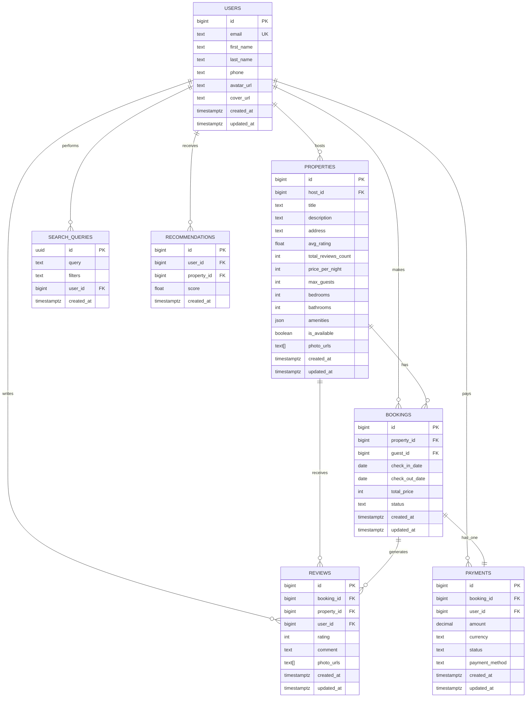
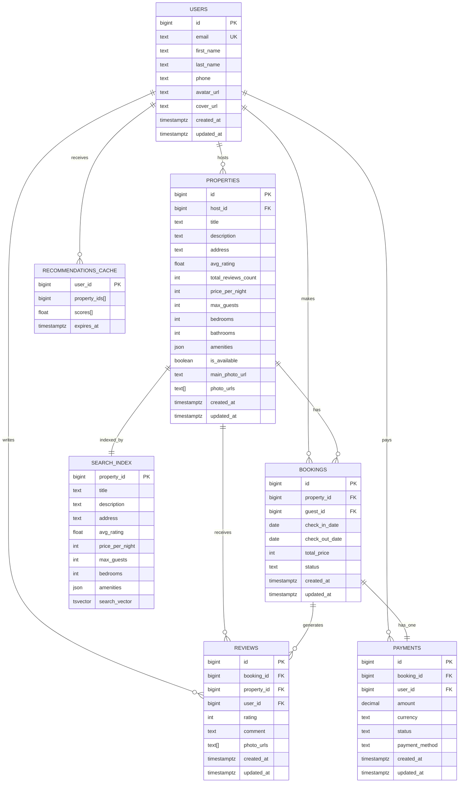
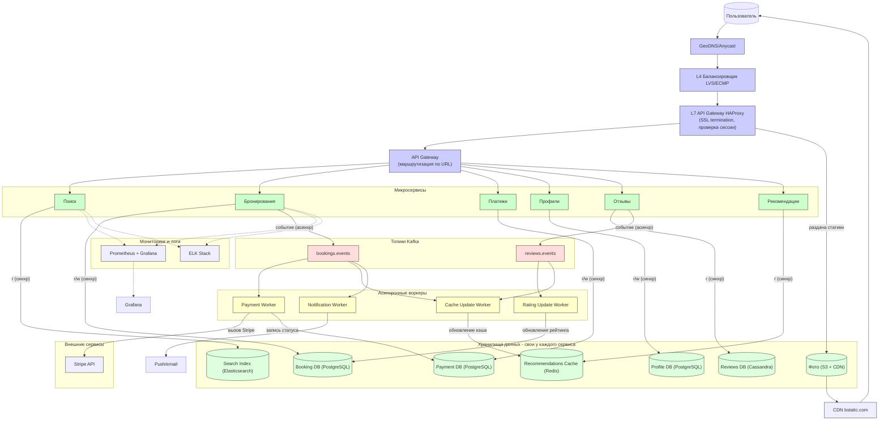

Курсовой проект по дисциплине "Проектирование высоконагруженных систем" (Highload).

---

## Содержание:
1. [Тема и целевая аудитория](#1)
2. [Расчёт нагрузки](#2)
3. [Глобальная балансировка нагрузки](#3)
4. [Локальная балансировка нагрузки](#4)

12. [Список ресурсов](#11)

---

## 1. Тема и целевая аудитория 

**Booking.com** — лидер мирового рынка онлайн-бронирования путешествий. Сервис объединяет миллионы объектов размещения (от частных апартаментов до пятизвездочных отелей) с арендаторами по всему миру.

### MVP
- Страница объявления с фотографиями и описанием.
- Система бронирования (транзакции, управление статусами).
- Статус доступности объекта в реальном времени.
- Создание и редактирование профиля пользователя.
- Создание и публикация отзывов.
- Создание и публикация объявлений.
- Просмотр отзывов и рейтингов.
- Поиск и фильтрация объектов.
- Рекомендации.

### Продуктовые метрики
- **Количество посещений в месяц:** ~560 млн пользователей [^1]
- **DAU (Daily Active Users):** ~17 млн активных пользователей [^2]
- **Объекты:** ~28 млн объявлений [^8]
- **Пользователи:** ~80 млн(на основе данных по Trip Adviser)[^5]

#### Региональное распределение:

| Регион                  | Процент |
|-------------------------|:---------:|
| CША                     | 10,13%  | 
| Великобритания          | 7,67%   |
| Германия                | 6,5%    | 
| Италия                  | 6,14%   |
| Другие                  | 63,44%  | 

---

## 2. Расчет нагрузки 

При показателях MAU ~560 млн и DAU ~17 млн, мы можем вычислить пиковую нагрузку. Данные по количеству зарегистрированных пользователей не были найедны, поэтому возьмем, как аналог, данные Tripadvisor - ~80 млн[^5]

* **Средний размер хранилища пользователя:**

| Данные           | Кол-во на одного пользователя | Размер единицы | Общий размер |
| ---------------- | ----------------------------- | -------------- | ------------ |
| Профиль          | 1                             | 410 КБ         | 410 КБ         |
| Текстовые отзывы | 4                             | 2 КБ           | 8 КБ        |
| Фото в отзывах   | 2                             | 200 КБ         | 400 КБ         |

*Профиль*: фото профиля (200 КБ), обложка профиля (200 КБ), остальная информация (имя, дата присоединения, избранное и т.п.) (10 КБ).

*Текстовые отзывы*: на данный момент на сайте опубликовано около 300 млн отзывов[^4]. Отзывы могут оставлять только зарегистрированные пользователи. Итак, в среднем 300млн / 80 млн ~ 4 отзыва на 1 пользователя.

*Фото в отзывах*(данные взяты по TripAdvisor): путешественники опубликовали более 160 млн таких фото[^6]. Итак, в среднем 160 млн / 80 млн = 2 фото на 1 пользователя.

Таким образом, данные, связанные с 1 пользователем, занимают в среднем **1 МБ** хранилища.

#### Среднее значение действий пользователя в день:

| Действие                          | Среднее количество в день на пользователя |
|-----------------------------------|-------------------------------------------|
| Поиск по параметрам               | 2                                         |
| Получение объявления              | 5                                        |
| Просмотр отзывов                  | 1,6                                         |
| Загрузка/изменение объявления     | 0.1                                       |
| Регистрация/Авторизация           | 0.31                                      |
| Бронирование                      | 0.2                                       |
| Публикация отзывов                | 0.005                                     |

*Публикация отзывов*: за 2022 год было опубликовано 30,2 млн отзывов[^7]. 30 млн / 365 дней / 17 млн ~ 0,005 отзыва в день в среднем на 1 зарегистрированного пользователя.

*Бронирование*: за 2023 год было сделано 1159 млн бронирований[^8]. 1159 млн / 365 дней / 17 млн ~ 0,2 бронирования в день на 1 пользователя

*Регситрация/Авторизация*: колличество зарегистрированных пользователей - 80 млн. 80 млн / 365 дней / 17 млн ~ 0,01 регистрация в день. Так как данных по количеству авторизаций нет, возьмем в учет то, что пользователь делает 0,2 бронирования в день. Значит в месяц получается около 6 бронирований в месяц. учитывая, что авторизация хранится в сессии, возьмем в среднем 3 авторизации в месяц. Значит, в день получается 0,3 авторизации. Общее число ~0,31 регистраций и авторизаций в день

*Загрузка/изменение объявления*: всего объявлений - 28 млн. Допустим, что каждый пользователь (арендодатель) публикует в месяц около 2 объявлений и редактирует их дважды. Тогда в день получается около 0,1 загрузок и редактирований

*Просмотр отзывов*: по данным статистики[^14] Каждый пользователь читает минимум 4 отзыва перед бронированием. Возьмем в среднем 8 отзывов на 1 бронирование. Тогда 8 отзывов х 0,2 бронирования в день = 1,6 просмотренных отзывов

*Получение объявлений*: основываясь на статистике[^3], количество страниц на 1 пользователя в день - 8 страниц. первая страница - главная, вторая - страница аккаунта пользователя, третья - страница с поиском объявлений. Тогда 5 страниц - страницы с каждым объявлением На одной странице 1 объявление. На 5 страницах - 5 объявлений. 

### Технические метрики

* **Общий объем хранимых данных:**

| Данные       | Размер |
| ------------ | ------ |
| Бронирование      | 44 ТБ  |
| Отзывы | 74 ТБ |
| Объявления       | 147 ТБ  |
| профиль      | 160 ТБ  |

*Объявления*: для каждого объявления хранятся общие данные (название, описание, адрес, рейтинг, категории и т.п.) (~ 0,5 МБ), фотографии (около 10 штук по 200 КБ каждая). Общее число объектов[^8] - 28 млн. Тогда (512 КБ + 10 * 200 КБ) * 28 млн = 66 ТБ.

*Профили*: 1 МБ * 80 млн (зарегистрированных пользователей[^5]) = 80 ТБ.

*Отзывы*: общее число отзывов[^4] - 300 млн,  общее число фото[^5] - 160 млн. Тогда 5,12 КБ * 300млн + 200 КБ * 160 млн = 32 ТБ.

*Бронирование*: примерно 0.5 КБ на одно бронирование, количество броней за последние 5 лет в среднем 4475 млн. Тогда 4475 млн. * 0.5 КБ = 2.3 ТБ

Общий объем хранилища составляет **181 ТБ**.

#### Сетевой трафик

Для существенных типов трафика при расчёте используется коэффициент суточной неравномерности *k* = 2 для определения пиковой нагрузки.

| Тип трафика | Суточный объём (Тбайт/сут) | Средний трафик (Гбит/с) | Пиковый трафик (*k*=2) (Гбит/с) |
| :--- | :--- | :--- | :--- |
| **Поиск объектов** | 17 млн × 2 × 1 Mбайт ≈ 34,1 | (34,1 × 8 × 1000) / 86400 = 3,16 | 6,32 |
| **Просмотр карточки объекта** | 17 млн × 5 × 5,5 Mбайт ≈ 490 | (490 × 8 × 1000) / 86400 = 45,4 | 90,8 |
| **Просмотр отзывов** | 17 млн × 1,6 × 0,5 МБ ≈ 13,6 | (13,6 × 8 × 1000) / 86400 = 1,26 | 2,52 |
| **Загрузка / изменение объявления** | 17 млн × 0,1 × 2 МБ ≈ 34,1 | (34,1 × 8 × 1000) / 86400 = 3,16 | 6,32 |
| **Публикация отзывов (фото)** | 17 млн × 0,005 × 0,4 МБ ≈ 6,8 | (6,8 × 8 × 1000) / 86400 = 0,63 | 1,26 |
| **Регистрация / авторизация** | 17 млн × 0,31 × 0,05 МБ ≈ 6,8 | (0,5 × 8 × 1000) / 86400 = 0,05 | 0,1 |
| **Бронирование** | 17 млн × 0,2 × 0,05 МБ ≈ 1,7 | (1,7 × 8 × 1000) / 86400 = 0,16 | 0,32 |
| **Итого** | **~580,8** | **~53,8** | **~107,6** |

Формула: *Трафик* = [ср. кол-во действий в день на 1 польз.] × [трафик на 1 действие] / 24 / 60 / 60 × DAU.

## RPS

RPS рассчитывается по формуле: **RPS = (DAU × Действия в сутки) / 86 400**.

| Тип запроса | Общее кол-во запросов в сутки | Средний RPS | Пиковый RPS (*k*=2) |
| :--- | :--- | :--- | :--- |
| **Поиск объектов** | 17 млн × 2 = 34 млн | 394 | 788 |
| **Просмотр карточки объекта** | 17 млн × 5 = 85 млн | 984 | 1 968 |
| **Просмотр отзывов** | 17 млн × 1,6 = 27,2 млн | 315 | 630 |
| **Загрузка / изменение объявления** | 17 млн × 0,1 = 1,7 млн | 20 | 40 |
| **Публикация отзывов** | 17 млн × 0,005 = 85 тыс. | 1 | 2 |
| **Регистрация / авторизация** | 17 млн × 0,31 = 5,27 млн | 61 | 122 |
| **Бронирование** | 17 млн × 0,2 = 3,4 млн | 39 | 78 |
| **Итого** | **~156,66 млн** | **~1 814** | **~3 628** |

# 3. Глобальная балансировка нагрузки

## 3.1 Функциональное разбиение по доменам

Для оптимизации обработки разнородных запросов и независимого масштабирования сервисов используются следующие домены:

| Доменное имя | Назначение |
| --- | --- |
| **`api.booking.com`** | Основное API (поиск, бронирование, профили, отзывы) |
| **`distribution-xml.booking.com`** | API для коммерческих партнёров (Demand API) [^15][^16] |
| **`supply-xml.booking.com`** | API для поставщиков жилья (Connectivity API) [^15] |
| **`secure-supply-xml.booking.com`** | Защищённый API для PCI/бронирований [^15] |
| **`bstatic.com`** | CDN для раздачи статики (фото отелей, JS, CSS) [^16] |
| **`booking.com`** | Основной веб-сайт (HTML-страницы) |

## 3.2 Расположение дата-центров

Booking.com использует гибридную инфраструктуру: собственная on-premises инфраструктура в сочетании с AWS [^17][^15][^19].

| ID | Локация | Обслуживаемый регион |
| --- | --- | --- |
| **DC-EU1, DC-EU2** | Амстердам / Франкфурт (Нидерланды / Германия) | Европа, Африка |
| **DC-US1** | Северная Вирджиния | Северная и Южная Америка |
| **DC-AP1** | Сингапур | Азия, Океания |

**Обоснование выбора:**

* **Амстердам:** штаб-квартира Booking.com, крупнейшая точка обмена трафиком в Европе. Обслуживает **~71,7%** трафика из Европы [^17].
* **Северная Вирджиния:** оптимальная точка входа в Северную Америку (**~13,5%** трафика).
* **Сингапур:** ключевой узел в Азиатско-Тихоокеанском регионе (**~11,5%** трафика + быстрорастущий рынок).

**Дополнительно:** Booking.com использует **Amazon CloudFront** для CDN-раздачи контента по всему миру [^16]

## 3.3 Распределение запросов по ДЦ

Нагрузка распределяется пропорционально активной аудитории регионов, исходя из рассчитанного пикового RPS **~3 628** и данных о региональном распределении трафика[^19].

| Регион (ДЦ) | Процент трафика | Пиковый RPS | Обоснование |
| --- | --- | --- | --- |
| **Европа (DC-EU1, EU2)** | **71,7%** | **~2 600** | Крупнейший регион: Германия, Италия, Нидерланды, Дания, Грузия, Швейцария, Кипр, Норвегия |
| **Америка (DC-US1)** | **13,5%** | **~490** | США (13,49% трафика) |
| **Азия и другие (DC-AP1)** | **14,8%** | **~538** | Марокко (Африка) + другие регионы (Азия, Океания) |
| **Итого** | **100%** | **~3 628** | |

**Детализация по Европе (71,7% трафика):[^19]**

| Страна | % от общего трафика | Пиковый RPS |
|--------|---------------------|-------------|
| Германия | 19,04% | ~690 |
| Италия | 16,99% | ~616 |
| Нидерланды | 9,69% | ~352 |
| Дания | 6,43% | ~233 |
| Грузия | 5,94% | ~216 |
| Швейцария | 5,50% | ~200 |
| Кипр | 4,82% | ~175 |
| Норвегия | 3,26% | ~118 |

## 3.4 Схема балансировки

Booking.com использует двухуровневую схему балансировки на основе **ECMP (Equal-Cost Multi-Path routing)**, **Anycast** и **HAProxy**[^17] .

### Уровень 1: Anycast + ECMP на уровне L3 (коммутаторы)

Трафик от пользователя попадает на **fabric switches** — коммутаторы ядра сети. С помощью Anycast пользователь направляется в ближайший ДЦ[^17]. Fabric switch на основе хэша потока (5-tuple: src IP, src port, dst IP, dst port) выбирает один из 5 равнозначных путей к **top-of-rack (ToR) коммутаторам** .

### Уровень 2: HAProxy на уровне L7

ToR коммутатор на основе хэша направляет трафик к одному из **HAProxy-балансировщиков** (актив-актив конфигурация)[^17]. HAProxy обеспечивает:
- Termination SSL
- Маршрутизацию к микросервисам
- Инъекцию/модификацию заголовков
- Health checks бэкендов

### Управление: Balancer API

Booking.com разработал собственную систему **Balancer** — Load Balancer as a Service (LBaaS) с единым API для управления всей инфраструктурой балансировки[^17]. Balancer API хранит конфигурацию в БД (объекты: load balancers, virtual servers, pools, servers) и автоматизирует provisioning[^17].

### Особенности архитектуры Booking.com[^17]

- **Актив-актив** конфигурация (нет простаивающих резервных устройств) 
- Горизонтальное масштабирование: **сотни HAProxy** вместо двух гигантских F5 
- **Сотни гигабит трафика** и **миллиарды запросов в день** 
- Интеграция с **Graphite** (метрики) и **Elasticsearch** (логи) 

## 3.5 Механизмы регулировки трафика

1. **Weighted Round-Robin:** использование весовых коэффициентов для управления долями входящего трафика между ДЦ в одном регионе .
2. **Active Health Checks:** HAProxy постоянно мониторит состояние бэкендов. При деградации сервиса — автоматическое исключение из пула .
3. **Anycast Healthchecker:** мониторинг состояния ДЦ. При падении ДЦ BGP-маршруты автоматически переключаются на ближайший работающий ДЦ .
4. **Smart Routing:** защита от сценариев отказа на всех уровнях сети (коммутаторы, балансировщики, серверы приложений) .
5. **Оркестрация через Balancer API:** автоматическое provisioning серверов, настройка HAProxy, управление пулами .

# 4. Локальная балансировка нагрузки

## 4.1 Схема балансировки

Внутри дата-центра реализована двухуровневая схема балансировки, основанная на архитектуре, описанной Booking.com на HAProxy Conf 2019 [^17].

**L4-балансировщик:**

| Параметр | Описание |
| --- | --- |
| **Реализация** | LVS (Linux Virtual Server) / ECMP на коммутаторах |
| **Режим работы** | Virtual Server via Direct Routing. Входящий трафик распределяется между узлами L7, а исходящий трафик идёт напрямую к клиенту, что минимизирует нагрузку на балансировщик [^17]. |
| **Резервирование** | Схема N × 2. Keepalived обеспечивает автоматическое переключение Virtual IP на резервный узел при отказе основного. |

Booking.com изначально использовал пару Linux-серверов с IPVS и Keepalived для L4-балансировки, но затем перешёл на ECMP (Equal-Cost Multi-Path routing) на уровне коммутаторов fabric layer [^17]. ECMP позволяет балансировать трафик на линейной скорости, так как не требует таблицы сессий — хэш потока вычисляется для каждого пакета [^17].

**L7-балансировщик:**

| Параметр | Описание |
| --- | --- |
| **Реализация** | Кластер серверов HAProxy |
| **Функции** | SSL Termination, распределение запросов по микросервисам, маршрутизация на основе URL, health checks  |
| **Оптимизация** | Session tickets для ускорения повторных TLS-соединений |
| **Резервирование** | Схема N + 1 |

Booking.com перешёл с F5 BIG-IP на HAProxy, поскольку F5 были физическими серверами, не поддающимися автоматизации конфигурации, и требовали ручного обновления [^20]. Новая архитектура позволила масштабироваться горизонтально — от пары балансировщиков до сотен, обрабатывающих миллиарды запросов в день[^20].

## 4.2 Расчёт количества балансировщиков

Расчёт выполнен для наиболее загруженного дата-центра (DC-EU1 — Европа) в «худшем» случае:

* **Пиковый трафик:** 107,6 Гбит/с (из п. 2.2 — Сетевой трафик, итого пиковый)
* **Пиковая нагрузка:** 3 628 RPS (из п. 2.2 — RPS, итого пиковый)

### 1. Расчёт узлов L4

Целевая конфигурация — серверы с сетевыми интерфейсами 25GbE (для Европы с трафиком 107,6 Гбит/с достаточно 25GbE, так как 100GbE избыточен). Ограничитель — пропускная способность канала.

**Расчёт активных узлов:**

107,6 Гбит/с ÷ 25 Гбит/с = 4,3 → 5 серверов

С учётом резервирования (N × 2): на каждую активную ноду нужен резерв.

**Итого:** 10 серверов.

### 2. Расчёт узлов L7

Конфигурация узлов: 8 CPU, NIC 25GbE. Учитываются два ограничителя: пропускная способность и SSL Termination.

**По пропускной способности:**

107,6 Гбит/с ÷ 25 Гбит/с = 4,3 → 5 серверов

**По SSL Termination:**

Интенсивность новых TLS-соединений принята равной общему RPS (так как каждый запрос может требовать нового TLS-рукопожатия или возобновления сессии):

3 628 RPS = 3 628 CPS (connections per second)

При производительности одного сервера 6 676 CPS (на базе 8 CPU cores, аналогично эталонному серверу из источника):

3 628 CPS ÷ 6 676 CPS ≈ 0,54 → 1 сервер

Так как расчёт по SSL даёт 1 сервер, а по пропускной способности — 5 серверов, выбираем «худший» случай — **5 серверов**.

С учётом резервирования (N + 1): 5 + 1 = 6 серверов.

**Итого:** 6 серверов.

### 3. Альтернативный расчёт для других ДЦ

| ДЦ | Пиковый трафик, Гбит/с | Пиковый RPS | L4 (25GbE) | L7 (по трафику) | L7 (по SSL) | L7 итого (N+1) |
| --- | --- | --- | --- | --- | --- | --- |
| **DC-EU1, EU2** (Европа) | 107,6 | 3 628 | 10 | 5 | 1 | 6 |
| **DC-US1, US2** (Америка) | ~25 (13,5% от 107,6) | ~490 | 4 | 1 | 1 | 2 |
| **DC-AP1** (Азия и др.) | ~27,5 (14,8% от 107,6) | ~538 | 4 | 1 | 1 | 2 |

## 4.3 Итоговая конфигурация оборудования

### Для Европы (DC-EU1, DC-EU2) — наиболее загруженный регион

| Уровень | Количество | Конфигурация узла | Тип резервирования |
| --- | --- | --- | --- |
| **L4** | 10 | CPU 4 Cores, NIC 25GbE | N × 2 |
| **L7** | 6 | CPU 8 Cores, NIC 25GbE | N + 1 |

### Для Америки (DC-US1, DC-US2)

| Уровень | Количество | Конфигурация узла | Тип резервирования |
| --- | --- | --- | --- |
| **L4** | 4 | CPU 4 Cores, NIC 25GbE | N × 2 |
| **L7** | 2 | CPU 8 Cores, NIC 25GbE | N + 1 |

### Для Азии (DC-AP1)

| Уровень | Количество | Конфигурация узла | Тип резервирования |
| --- | --- | --- | --- |
| **L4** | 4 | CPU 4 Cores, NIC 25GbE | N × 2 |
| **L7** | 2 | CPU 8 Cores, NIC 25GbE | N + 1 |

### Общая потребность по всем ДЦ

| Уровень | Всего серверов | Конфигурация узла |
| --- | --- | --- |
| **L4** | 10 (EU) + 4 (US) + 4 (AP) = **18** | CPU 4 Cores, NIC 25GbE |
| **L7** | 6 (EU) + 2 (US) + 2 (AP) = **10** | CPU 8 Cores, NIC 25GbE |
| **Итого** | **28** | |

## 4.4 Обоснование выбора NIC 25GbE

Для Booking.com с пиковым трафиком **107,6 Гбит/с** использование 100GbE NIC является избыточным, так как:
- 100GbE требует более дорогого сетевого оборудования (коммутаторы, трансиверы)
- 25GbE обеспечивает достаточную пропускную способность с запасом (5 узлов × 25 Гбит/с = 125 Гбит/с > 107,6 Гбит/с)
- 25GbE — стандарт де-факто для высоконагруженных систем среднего размера

При росте трафика в будущем возможно поэтапное обновление до 100GbE.

---

# 5. Логическая схема БД

## 5.1 Схема БД

## 5.2 Таблица с описанием таблиц

| Таблица | Описание | Размер строки | Количество строк | Размер таблицы | Нагрузка на запись (QPS, пик) | Нагрузка на чтение (QPS, пик) |
| :--- | :--- | :--- | :--- | :--- | :--- | :--- |
| **`users`** | Профили пользователей (гости + хосты) | id(8) + email(50) + first_name(30) + last_name(30) + phone(15) + avatar_url(100) + cover_url(100) + created_at(8) + updated_at(8) ≈ 349 Б | 80 млн | ~28 ГБ | 61 | 1 814 |
| **`properties`** | Объявления (отели, апартаменты) | id(8) + host_id(8) + title(100) + description(500) + address(200) + avg_rating(4) + total_reviews_count(4) + price_per_night(4) + max_guests(2) + bedrooms(2) + bathrooms(2) + amenities(500) + is_available(1) + photo_urls(2000) + created_at(8) + updated_at(8) ≈ 3,35 КБ | 28 млн | ~94 ГБ | 20 | 1 968 |
| **`bookings`** | Бронирования | id(8) + property_id(8) + guest_id(8) + check_in_date(4) + check_out_date(4) + total_price(4) + status(20) + created_at(8) + updated_at(8) ≈ 72 Б | 1,16 млрд (за 5 лет) | ~83 ГБ | 39 | 78 |
| **`payments`** | Платежи | id(8) + booking_id(8) + user_id(8) + amount(8) + currency(3) + status(20) + payment_method(20) + created_at(8) + updated_at(8) ≈ 91 Б | 1,16 млрд | ~105 ГБ | 39 | 78 |
| **`reviews`** | Отзывы пользователей | id(8) + booking_id(8) + property_id(8) + user_id(8) + rating(2) + comment(2000) + photo_urls(2000) + created_at(8) + updated_at(8) ≈ 4 КБ | 300 млн | ~1,2 ТБ | 1 | 630 |
| **`search_queries`** | История поисков | id(16) + query(100) + filters(500) + user_id(8) + created_at(8) ≈ 632 Б | 34 млн/сут | ~21 ГБ/сут | 788 | 394 |
| **`recommendations`** | Рекомендации (кэш) | id(8) + user_id(8) + property_id(8) + score(4) + created_at(8) ≈ 36 Б | 1,6 млрд/сут | ~58 ГБ/сут | 1 814 | 1 814 |

## 5.3 Требования к консистентности

| Таблица | Требование | Обоснование |
| :--- | :--- | :--- |
| **`users`** | Strong Consistency | Данные профиля должны быть актуальны при каждой авторизации |
| **`properties`** | Strong Consistency | Статус доступности и цены должны быть точными для бронирования |
| **`bookings`** | Strong Consistency | Транзакции с деньгами требуют строгой консистентности (ACID) |
| **`payments`** | Strong Consistency | Платежи — критическая операция, потеря недопустима |
| **`reviews`** | Eventual Consistency | Отзывы допускают небольшую задержку после публикации |
| **`search_queries`** | Eventual Consistency | Аналитика, допустима задержка |
| **`recommendations`** | Eventual Consistency | Кэш рекомендаций можно обновлять асинхронно |

# 6. Физическая схема БД

## Денормализация

1. Для оптимизации загрузки главной страницы (списка популярных объявлений) в таблицу `properties` добавлено поле `avg_rating` — средний рейтинг, который обновляется асинхронно при добавлении новых отзывов. Это позволяет отображать рейтинг без JOIN с `reviews`.
2. В `properties` хранится `total_reviews_count` для быстрого отображения количества отзывов без агрегации по `reviews`.
3. Фотографии объявлений хранятся в массиве `photo_urls` внутри таблицы `properties` — это позволяет получить все фото одним запросом.
4. Фотографии отзывов хранятся в массиве `photo_urls` внутри таблицы `reviews` — аналогично.
5. Для ускорения поиска добавлена таблица `search_index` — денормализованное представление объявлений с ключевыми полями для фильтрации.

## 6.1 Выбор СУБД

| Таблица / Хранилище | СУБД / хранилище | Обоснование |
| :--- | :--- | :--- |
| `users`, `properties`, `bookings`, `payments`, `reviews` | **PostgreSQL** | ACID-транзакции (бронирования, платежи), строгая консистентность, сложные JOIN-запросы |
| `search_index` | **Elasticsearch** | Полнотекстовый поиск, геопоиск, фильтрация по множеству полей, высокая производительность чтения |
| `recommendations_cache` | **Redis** | Низкая задержка, частые чтения, TTL для кэша рекомендаций |
**Итого:**

- **PostgreSQL:** `users`, `properties`, `bookings`, `payments`, `reviews`
- **Elasticsearch:** `search_index`
- **Redis:** `recommendations_cache`, кэш сессий, кэш популярных объявлений

## 6.2 Индексы

Расчёт размера индексов по формуле: `(размер_ключа + 8 байт указатель) × количество_строк × 1.3`

| Таблица | Поле | Тип индекса | Размер индекса | Обоснование |
| :--- | :--- | :--- | :--- | :--- |
| **`users`** | `id` (PK) | B-Tree | (8+8) × 80M × 1.3 ≈ 1,66 ГБ | Поиск профиля по ID |
| **`users`** | `email` (UK) | B-Tree | (50+8) × 80M × 1.3 ≈ 6,03 ГБ | Поиск при авторизации |
| **`users`** | `phone` (UK) | B-Tree | (15+8) × 80M × 1.3 ≈ 2,39 ГБ | Поиск при авторизации |
| **`properties`** | `id` (PK) | B-Tree | (8+8) × 28M × 1.3 ≈ 0,58 ГБ | Доступ к карточке объявления |
| **`properties`** | `host_id` | B-Tree | (8+8) × 28M × 1.3 ≈ 0,58 ГБ | Поиск всех объявлений хоста |
| **`properties`** | `(price_per_night, avg_rating)` | Composite B-Tree | (4+4+8) × 28M × 1.3 ≈ 0,58 ГБ | Сортировка и фильтрация при поиске |
| **`properties`** | `is_available` | B-Tree | (1+8) × 28M × 1.3 ≈ 0,33 ГБ | Фильтрация доступных объявлений |
| **`bookings`** | `id` (PK) | B-Tree | (8+8) × 1,16B × 1.3 ≈ 24,1 ГБ | Доступ к бронированию |
| **`bookings`** | `guest_id` | B-Tree | (8+8) × 1,16B × 1.3 ≈ 24,1 ГБ | История бронирований пользователя |
| **`bookings`** | `property_id` | B-Tree | (8+8) × 1,16B × 1.3 ≈ 24,1 ГБ | Поиск броней для календаря |
| **`bookings`** | `(guest_id, status)` | Composite B-Tree | (8+20+8) × 1,16B × 1.3 ≈ 54,3 ГБ | Фильтрация активных броней |
| **`payments`** | `id` (PK) | B-Tree | (8+8) × 1,16B × 1.3 ≈ 24,1 ГБ | Доступ к платежу |
| **`payments`** | `booking_id` | B-Tree | (8+8) × 1,16B × 1.3 ≈ 24,1 ГБ | Связь платежа с бронированием |
| **`payments`** | `user_id` | B-Tree | (8+8) × 1,16B × 1.3 ≈ 24,1 ГБ | История платежей пользователя |
| **`payments`** | `status` | B-Tree | (20+8) × 1,16B × 1.3 ≈ 42,2 ГБ | Фильтрация по статусу платежа |
| **`reviews`** | `id` (PK) | B-Tree | (8+8) × 300M × 1.3 ≈ 6,24 ГБ | Доступ к отзыву |
| **`reviews`** | `property_id` | B-Tree | (8+8) × 300M × 1.3 ≈ 6,24 ГБ | Получение отзывов об объявлении |
| **`reviews`** | `user_id` | B-Tree | (8+8) × 300M × 1.3 ≈ 6,24 ГБ | Отзывы пользователя |
| **`reviews`** | `(property_id, rating)` | Composite B-Tree | (8+2+8) × 300M × 1.3 ≈ 7,02 ГБ | Сортировка отзывов по рейтингу |
| **`search_queries`** | `id` (PK) | B-Tree | (16+8) × 34M/сут × 1.3 ≈ 1,06 ГБ/сут | Уникальный ID поиска |
| **`search_queries`** | `user_id` | B-Tree | (8+8) × 34M/сут × 1.3 ≈ 0,71 ГБ/сут | История поиска пользователя |
| **`recommendations`** | `id` (PK) | B-Tree | (8+8) × 1,6B/сут × 1.3 ≈ 33,3 ГБ/сут | Доступ к рекомендации |
| **`recommendations`** | `user_id` | B-Tree | (8+8) × 1,6B/сут × 1.3 ≈ 33,3 ГБ/сут | Рекомендации пользователя |

## 6.3 Шардирование и резервирование СУБД

**Шардирование** (только для таблиц > 100 ГБ)

| Таблица | СУБД | Ключ шардирования | Размер | Обоснование |
| :--- | :--- | :--- | :--- | :--- |
| `reviews` | PostgreSQL | `property_id` | 1,2 ТБ (>100 ГБ) | Все отзывы об одном объекте на одном узле |
| `payments` | PostgreSQL | `user_id` | 105 ГБ (>100 ГБ) | Все платежи пользователя на одном узле |
| `bookings` | PostgreSQL | `guest_id` | 83 ГБ (<100 ГБ) | Шардирование не требуется |
| `properties` | PostgreSQL | — | 94 ГБ (<100 ГБ) | Шардирование не требуется |
| `users` | PostgreSQL | — | 28 ГБ (<100 ГБ) | Шардирование не требуется |

**Резервирование**

| СУБД | Схема | Обоснование |
| :--- | :--- | :--- |
| PostgreSQL | Master–Replica (1 мастер, 2 реплики). Запись на мастер, чтение с реплик. Автоматический failover через Patroni | Исключение единой точки отказа, распределение нагрузки чтения (1 814–1 968 RPS) |
| Elasticsearch | Каждый шард имеет 1 реплику (Replication Factor = 2). Master-узел выбирается автоматически | Отказоустойчивость поиска, сохранение данных при падении узла |
| Redis | Redis Cluster (мастер + реплика на каждый слот). Автоматический failover | Отказоустойчивость кэша рекомендаций |

## 6.4 Клиентские библиотеки и интеграции

| СУБД | Примеры для Go | Примеры для Python |
| :--- | :--- | :--- |
| PostgreSQL | `pgx`, `jackc/pgx` | `psycopg2`, `asyncpg`, `SQLAlchemy` |
| Elasticsearch | `elastic/go-elasticsearch` | `elasticsearch-py`, `elasticsearch-dsl` |
| Redis | `go-redis/redis` | `redis-py`, `aredis` |

## 6.5 Балансировка запросов и мультиплексирование подключений

| СУБД | Механизм | Как работает |
| :--- | :--- | :--- |
| PostgreSQL | PgBouncer (пул соединений) | PgBouncer поддерживает пул постоянных соединений к PostgreSQL, объединяя множество коротких подключений в ограниченное число долгоживущих сессий. Это снижает накладные расходы на создание новых соединений (пик ~3 628 RPS) |
| Elasticsearch | Встроенный HTTP-балансировщик + клиентское кеширование | Клиент получает список узлов и распределяет запросы round-robin. Запросы к поиску кешируются на уровне приложения |
| Redis | Smart Client (go-redis) | Клиент сам вычисляет, какой узел кластера отвечает за ключ (CRC16 хэш слота), и обращается к нему напрямую |

## 6.6 Схема резервного копирования

| Хранилище | Что бэкапим | Как бэкапим | Зачем |
| :--- | :--- | :--- | :--- |
| PostgreSQL | `users`, `properties`, `bookings`, `payments`, `reviews` | Ежедневный полный бэкап + непрерывная архивация WAL (pg_basebackup + WAL-G) | Можно восстановить на любой момент времени (до секунды). Критично для бронирований и платежей |
| Elasticsearch | `search_index` | Ежедневные снапшоты (Elasticsearch Snapshot API) + инкрементальные бэкапы изменений | Восстановление поискового индекса при коррупции данных |
| Redis | `recommendations_cache`, сессии | AOF (каждую секунду) + RDB (раз в час) | Минимум потерь (до 1 секунды), легкое восстановление кэша |

## 6.7 Сводная таблица требований к БД

| Хранилище | Таблицы / данные | RPS чтения (пик) | RPS записи (пик) | Объём данных | Ключевое требование |
| :--- | :--- | :--- | :--- | :--- | :--- |
| PostgreSQL | `users` | 1 814 | 61 | ~28 ГБ | Strong Consistency |
| PostgreSQL | `properties` | 1 968 | 20 | ~94 ГБ | Strong Consistency |
| PostgreSQL | `bookings` | 78 | 39 | ~83 ГБ | Strong Consistency (ACID) |
| PostgreSQL | `payments` | 78 | 39 | ~105 ГБ | Strong Consistency (ACID) |
| PostgreSQL | `reviews` | 630 | 1 | ~1,2 ТБ | Eventual Consistency |
| Elasticsearch | `search_index` | 788 | 788 | ~21 ГБ/сут | Eventual Consistency |
| Redis | `recommendations_cache` | 1 814 | 1 814 | ~58 ГБ/сут | Eventual Consistency |

## 8. Технологии

| Технология | Область применения | Мотивационная часть |
|------------|---------------------|---------------------|
| **Golang** | Основная бизнес-логика backend и микросервисы (поиск, бронирования, отзывы, профили) | • Поддержка многопоточности и микросервисной архитектуры • Высокая производительность при 3 628 RPS пиковой нагрузки • Быстрая разработка и низкий порог входа • Отличная поддержка конкурентности (goroutines) для обработки тысяч одновременных запросов |
| **TypeScript + React + Redux** | Frontend (SPA-интерфейс для пользователей) | • React подходит для построения сложного SPA-интерфейса с динамическими страницами (поиск, карточка отеля, личный кабинет) • Redux удобен для централизованного управления состоянием (фильтры поиска, корзина бронирований, авторизация) • TypeScript обеспечивает статическую типизацию и упрощает поддержку кода на большом проекте |
| **Python** | Алгоритмы рекомендаций и машинного обучения | • Большое число библиотек для ML и работы с данными (scikit-learn, TensorFlow, PyTorch) • Быстрая разработка прототипов рекомендательных систем • Удобство работы с pandas для анализа истории поисков и бронирований |
| **PostgreSQL** | Основное транзакционное хранилище данных (пользователи, объявления, бронирования, отзывы, платежи) | • Обеспечивает надёжность и транзакционность (ACID) — критически важно для бронирований и платежей • Поддержка сложных JOIN-запросов между таблицами • Мощная система индексов (B-Tree, Hash, Composite) для ускорения запросов до 1 968 RPS • Нативная поддержка JSONB для хранения удобств отеля • Расширение PostGIS для геопоиска отелей на карте |
| **Citus** (расширение PostgreSQL) | Горизонтальное шардирование PostgreSQL | • Добавляет горизонтальное шардирование для таблиц >100 ГБ (`reviews` 1,2 ТБ, `payments` 105 ГБ) • Позволяет масштабировать нагрузку на чтение и запись • Прозрачен для приложения — работает как обычный PostgreSQL |
| **Elasticsearch** | Полнотекстовый поиск объявлений и подсказки | • Поддерживает инвертированные индексы для быстрого полнотекстового поиска по 28 млн объявлений • Хорошо подходит для поиска по большому каталогу с фильтрацией (цена, рейтинг, удобства) • Поддержка геопоиска (отели рядом с достопримечательностями) • Высокая производительность при 788 RPS поисковых запросов |
| **Redis** | Кэш рекомендаций, сессий, популярных объявлений | • Быстрое in-memory хранилище с задержкой <1 мс • Обеспечивает минимальную задержку доступа по ключу для 1 814 RPS чтения рекомендаций • Поддержка TTL для автоматического истечения кэша • Redis Cluster для отказоустойчивости |
| **Kafka** | Асинхронная передача событий между сервисами | • Сообщения между сервисами (бронирование → платёж, отзыв → обновление рейтинга) должны обрабатываться асинхронно и надёжно • Kafka обеспечивает масштабируемую очередность и доставку событий в реальном времени • Позволяет декомпозировать монолитную логику в микросервисы |
| **S3** | Хранение медиафайлов (фото объявлений, фото отзывов, аватары) | • Объектная структура хранения хорошо подходит для медиафайлов (~147 ТБ) • Отсутствие жёсткой файловой иерархии упрощает масштабирование и распределённое хранение • Позволяет хранить большие бинарные данные вне основной БД и обращаться к ним по ссылке • Дешевле PostgreSQL в 100 раз для хранения больших объёмов |
| **CDN (CloudFront / bstatic.com)** | Раздача статики и медиафайлов пользователям | • Снижает нагрузку на основной дата-центр при пиковом трафике 107,6 Гбит/с • Фото раздаются с edge-серверов, ближайших к пользователю (низкая задержка) • Уменьшает исходящий трафик из S3 |
| **HAProxy** | L7-балансировка, SSL-терминация | • Лёгкий и производительный L7-балансировщик • Позволяет эффективно распределять запросы по микросервисам на основе URL • Booking.com перешёл с F5 на HAProxy именно для автоматизации конфигурации через Balancer API • Поддержка SSL Termination для централизованного управления сертификатами |
| **LVS / ECMP** | L4-балансировка на уровне коммутаторов | • Работает на линейной скорости (25+ Гбит/с) без нагрузки на CPU • Не требует таблицы сессий — производительность не падает с ростом числа соединений • ECMP распределяет трафик по HAProxy на основе хэша 5-tuple |
| **Docker** | Контейнеризация сервисов | • Обеспечивает единое окружение для запуска сервисов (разработка → тестирование → продакшн) • Упрощает сборку, доставку и развертывание приложений • Лёгкая изоляция микросервисов друг от друга |
| **Kubernetes** | Управление контейнеризированными приложениями | • Автоматизация развертывания и масштабирования сервисов под нагрузку 3 628 RPS • Повышение отказоустойчивости (автоматический перезапуск упавших подов) • Удобство эксплуатации и rolling-обновления без даунтайма • Service Discovery для внутренней маршрутизации между микросервисами |
| **Prometheus + Grafana** | Мониторинг и визуализация метрик | • Автоматический сбор метрик со всех сервисов (RPS, задержки, ошибки,利用率 CPU/памяти) • Визуализация нагрузки, задержек и ошибок в реальном времени • Поддержка алертов при превышении порогов (например, 90% от 107,6 Гбит/с) |
| **Elastic Stack (ELK)** | Централизованное логирование | • Сбор логов со всех сервисов в единое место • Быстрый поиск по логам при отладке инцидентов • Визуализация ошибок и предупреждений |
| **Terraform** | Инфраструктура как код (IaC) | • Описание инфраструктуры (серверы, сети, балансировщики) в декларативных конфигурациях • Возможность воссоздать всю инфраструктуру за минуты • Версионирование изменений инфраструктуры в Git |

## 9. Схема проекта

## Пояснения к схеме

### Типы взаимодействия

- **Синхронные запросы** (сплошные стрелки с метками `r` (чтение) или `r/w` (чтение/запись)):  
  Пользовательский запрос проходит через GeoDNS, L4‑балансировщик, HAProxy и API Gateway, а затем направляется в соответствующий микросервис. Микросервис синхронно обращается к своей базе данных и возвращает ответ.

- **Асинхронные события** (через Kafka):  
  Сервисы «Бронирования» и «Отзывы» публикуют события в топики `bookings.events` и `reviews.events`. Эти события обрабатываются воркерами, которые выполняют фоновые задачи без блокировки основного потока запросов.

### Собственные базы данных

Каждый микросервис владеет выделенным хранилищем данных, что обеспечивает слабую связанность и независимое масштабирование:

| Микросервис | Тип БД | Назначение |
|-------------|--------|-------------|
| Поиск | Elasticsearch | Полнотекстовый поиск по объявлениям |
| Бронирования | PostgreSQL | Хранение бронирований (ACID) |
| Платежи | PostgreSQL | Хранение платежей и связь с внешним Stripe |
| Профили | PostgreSQL | Данные пользователей |
| Отзывы | Cassandra | Масштабируемое хранение отзывов (1,2 ТБ) |
| Рекомендации | Redis | Кэш персонализированных рекомендаций |

Фотографии и статика вынесены в объектное хранилище **S3 + CDN**, что снижает нагрузку на основную базу данных.

### Воркеры (асинхронные консюмеры Kafka)

Воркеры вынесены в отдельный блок, подписаны на конкретные топики и выполняют фоновые задачи:

| Воркер | Подписка | Действие |
|--------|----------|----------|
| Rating Update Worker | `reviews.events` | Пересчёт `avg_rating` в PostgreSQL |
| Payment Worker | `bookings.events` | Вызов Stripe API, запись статуса платежа |
| Cache Update Worker | `reviews.events`, `bookings.events` | Обновление Redis (рейтинги, популярные отели) |
| Notification Worker | `bookings.events` | Отправка push/email уведомлений |

### Внешний платёжный сервис

Платежи обрабатываются через **Stripe API**. `Payment Worker` вызывается асинхронно, что позволяет не блокировать создание бронирования. При успешном или неудачном платеже статус записывается в базу `Payment DB` (PostgreSQL).

### Мониторинг и логи

Пунктирные линии на схеме показывают сбор метрик и логов:

- **Prometheus + Grafana** собирают метрики со всех микросервисов (RPS, задержки, ошибки, использование ресурсов) и предоставляют дашборды и алерты.
- **ELK Stack (Elasticsearch, Logstash, Kibana)** централизованно собирает логи для анализа инцидентов и отладки.

### Маршрутизация и балансировка

- **GeoDNS / Anycast** направляет пользователя в ближайший дата-центр (Европа, США или Азия) на основе IP-адреса.
- **L4-балансировщик** (LVS + ECMP на коммутаторах) распределяет трафик между несколькими узлами HAProxy, используя ECMP с хэшированием по 5‑tuple. Keepalived обеспечивает резервный Virtual IP.
- **L7 API Gateway (HAProxy)** выполняет SSL-терминацию, проверяет сессию через Redis, маршрутизирует запросы к соответствующим микросервисам по URL (`/api/search` → поиск, `/api/booking` → бронирования и т.д.).

### Микросервисы и нагрузка

Микросервисы на **Golang** обрабатывают бизнес-логику. Каждый сервис масштабируется независимо под нагрузку (пик до **3 628 RPS**). Пометки `r/w` на стрелках означают чтение/запись. В большинстве случаев чтение доминирует (1 968 RPS на `properties` против 20 RPS записи).

### Хранилища данных

- **PostgreSQL** (основное хранилище) содержит таблицы `users`, `properties`, `bookings`, `payments`, `reviews`. Для таблиц `reviews` (1,2 ТБ) и `payments` (105 ГБ) используется шардирование через Citus. Резервивание: мастер + 2 реплики, failover через Patroni.
- **Elasticsearch** обслуживает полнотекстовый поиск по 28 млн объявлений (788 RPS пик). Индекс шардирован и реплицирован (RF=2).
- **Redis** хранит сессии, кэш рекомендаций (1 814 RPS чтения) и популярные объявления в кластерной конфигурации (мастер+реплика на слот).
- **S3 + CDN (bstatic.com)** хранят и раздают фото объявлений и отзывов (~147 ТБ). CDN снижает нагрузку на дата-центр при пиковом трафике 107,6 Гбит/с.

### Асинхронная обработка

**Apache Kafka** обеспечивает асинхронную обработку событий (например, обновление среднего рейтинга после нового отзыва, создание платежа после бронирования). Это позволяет развязать микросервисы и повысить отказоустойчивость.
## 10. Обеспечение надёжности

| Компонент системы | Метод обеспечения надёжности |
| :--- | :--- |
| **LVS (L4-балансировщик)** | Резервирование Active‑Passive через Keepalived. При отказе основного узла Virtual IP переключается на резервный. |
| **HAProxy (L7-балансировщик)** | Актив-актив конфигурация с горизонтальным масштабированием (6 узлов в Европе). При падении одного экземпляра ECMP на коммутаторах автоматически исключает его из пула. |
| **PostgreSQL** | Master – Replica (1 мастер, 2 реплики). Все записи идут на мастер, чтение – с реплик. Автоматический failover через Patroni (10‑30 секунд). Репликация асинхронная, но для критичных операций используется подтверждение от одной реплики (полусинхронный режим). |
| **Citus (шардирование)** | Каждый шард (для `reviews` и `payments`) имеет собственную репликацию (мастер+реплики). При выходе узла из строя Citus перераспределяет трафик на живые реплики. |
| **Elasticsearch** | Каждый шард индекса `search_index` реплицирован (Replication Factor = 2). При отказе узла запросы автоматически направляются на реплику, а недостающие шарды восстанавливаются. |
| **Redis** | Redis Cluster: каждый слот (ключевой диапазон) обслуживается мастером и одной репликой. При падении мастера слот автоматически переключается на реплику. |
| **Apache Kafka** | Репликация партиций (обычно RF=3). Настройка `acks=all` и `min.insync.replicas=2` гарантирует, что сообщение не будет подтверждено, пока не записано на большинство реплик. При сбое брокера лидер партиции перевыбирается из in‑sync реплик. |
| **S3 / CDN** | S3 обеспечивает 11 девяток долговечности за счёт автоматической репликации внутри региона. Дополнительно настроена георепликация между EU, US и AP. CDN (CloudFront) кэширует контент на edge‑узлах, что делает его доступным даже при проблемах с исходным S3. |
| **Микросервисы (Golang)** | Запущены в Kubernetes. Автоматический перезапуск упавших подов (liveness‑пробы). Rolling‑обновления без даунтайма. Каждый сервис спроектирован идемпотентно для повторной обработки событий из Kafka. |
| **Kubernetes** | Автоматическое масштабирование подов (Horizontal Pod Autoscaler) при росте RPS. Node‑failure detection – перераспределение подов на живые узлы. |

**Graceful Shutdown**: при обновлении версии микросервиса или плановом выводе узла из эксплуатации компонент перестаёт принимать новые запросы, завершает обработку уже принятых (в рамках time‑out) и только после этого завершает процесс. Это исключает потерю данных и резкие обрывы соединений.

**Graceful Degradation**: архитектура спроектирована так, что отказ одного компонента не приводит к полной недоступности сервиса.

- Если отказывает **Elasticsearch** – поиск становится временно недоступен, но бронирование, просмотр карточек отелей и отзывов работают через PostgreSQL (хоть и с большей задержкой).
- Если падает **Redis** – пользователи не получают персонализированных рекомендаций, но сессии уже активны (их можно проверять через прямые запросы к `users`), а кэш популярных объявлений перестаёт обновляться, но продолжает отдавать устаревшие данные.
- При сбое **Kafka** – асинхронное обновление рейтингов и кэша приостанавливается, но основные операции (бронирование, платежи) продолжают выполняться синхронно, а накопленные события будут обработаны после восстановления брокера.
- Если выходит из строя целый **дата-центр** (например, DC‑EU1), Anycast автоматически перенаправляет трафик в ближайший работающий ДЦ (DC‑EU2 или DC‑US1). Данные реплицируются между регионами асинхронно, что гарантирует eventual consistency.

## 11. Расчёт ресурсов

Все сервисы развёртываются в **4 дата-центрах** (DC‑EU1, DC‑EU2, DC‑US1, DC‑AP1) в гибридной инфраструктуре (on‑premises + AWS). Stateless-микросервисы на Go работают под управлением Kubernetes; stateful-компоненты (PostgreSQL, Elasticsearch, Redis, Kafka, Ceph) — на физических серверах вне оркестрации.

Расчёты выполнены для **Европы (DC‑EU1 + DC‑EU2)**, на которую приходится **71,7%** трафика, пиковая нагрузка **3 628 RPS**, пиковый трафик **107,6 Гбит/с**. Для США (DC‑US1, 13,5% трафика) и Азии (DC‑AP1, 14,8% трафика) количество серверов рассчитано пропорционально этим долям с сохранением минимальных отказоустойчивых конфигураций.

### 11.1 Базовый расчёт аппаратных ресурсов

Начав с аудиторных показателей (DAU, MAU), мы перевели их в RPS, объёмы данных и сетевой трафик. Затем выделили доменные зоны и сервисы. Теперь определяем необходимое оборудование, исходя из удельного потребления ресурсов на единицу нагрузки.

#### Градация типов нагрузки

Для оценки производительности использована следующая градация:

| Тип нагрузки | Характеристика | Технология | Оценочная производительность (RPS/ядро) | RAM на экземпляр |
|--------------|----------------|------------|-----------------------------------------|------------------|
| **Лёгкая** | Запросы к in‑memory хранилищам (Redis), минимум вычислений, задержка < 1 мс | Go | 5 000 | 100 МБ – 1 ГБ |
| **Средняя** | Бизнес‑логика с запросами к PostgreSQL, JOIN, ACID, задержка 1–10 мс | Go | 2 000 | 1 ГБ – 4 ГБ |
| **Тяжёлая** | Сложные вычисления, длительные сетевые вызовы (внешние API), работа с поиском | Go (Elasticsearch) | 3 000 | 2 ГБ – 4 ГБ |
| **SSL‑терминация** | TLS handshake (CPS) | HAProxy | 6 676 CPS/ядро | 50 МБ |
| **Базы данных (ACID)** | Высокоинтенсивные чтение/запись с индексами | PostgreSQL | 2 000 | 8 ГБ – 16 ГБ |
| **NoSQL / широкие колонки** | Eventual consistency, высокие RPS | Cassandra | 3 000 | 8 ГБ – 16 ГБ |

Эти оценки базируются на синтетических бенчмарках [TechEmpower Framework Benchmarks](https://www.techempower.com/benchmarks/#section=data-r22&test=fortune) и публичных испытаниях Nginx [nginx.com](https://www.nginx.com/blog/testing-the-performance-of-nginx-and-nginx-plus-web-servers/).

#### Ресурсные требования микросервисов (Европа)

| Сервис | Пиковая нагрузка (Европа) | Тип нагрузки | CPU (ядер), всего | RAM (всего) | Примечание |
|--------|---------------------------|--------------|-------------------|-------------|-------------|
| **LVS (L4)** | 107,6 Гбит/с | Сетевой | 4 ядра × 10 серверов = 40 | 40 ГБ | ECMP на коммутаторах, LVS – резерв |
| **HAProxy (L7)** | 3 628 CPS | Тяжёлая (SSL) | 8 ядер × 6 серверов = 48 | 48 ГБ | Расчёт в разделе 4.2 |
| **search‑service** | 788 RPS | Тяжёлая (Elasticsearch) | 4 | 8 ГБ | Кластер Elasticsearch |
| **booking‑service** | 200 RPS | Средняя (PostgreSQL) | 4 | 8 ГБ | Операции бронирования |
| **payment‑service** | 150 RPS | Средняя (PostgreSQL) | 4 | 8 ГБ | Платежи, ACID |
| **profile‑service** | 1 875 RPS | Лёгкая (Redis/кэш) | 4 | 8 ГБ | Сессии, профили |
| **review‑service** | 631 RPS | Средняя (PostgreSQL + Kafka) | 4 | 8 ГБ | Отзывы, события |
| **recommendation‑service** | 1 814 RPS | Лёгкая (Redis) | 4 | 8 ГБ | Кэш рекомендаций |
| **kafka‑consumer** | ~2 300 событий/с | Лёгкая / Средняя | 2 | 4 ГБ | Асинхронные workers |
| **PostgreSQL (кластер)** | 1 968 RPS чтения, 60 RPS записи | База данных (ACID) | 192 (весь кластер) | 768 ГБ | 3 шарда × (мастер + 2 реплики) = 9 серверов; на сервер: 64 ядра, 256 ГБ RAM |
| **Elasticsearch** | 788 RPS поиска | Поисковая нагрузка | 32 | 64 ГБ | Кластер из 3 узлов (16 ядер, 32 ГБ каждый) |
| **Redis** | 1 814 RPS чтения + 1 814 RPS записи + сессии | Лёгкая / In‑memory | 16 | 32 ГБ | Redis Cluster: 3 мастера + 3 реплики = 6 узлов |
| **Kafka** | ~2 300 событий/с | Тяжёлая (потоковая) | 8 | 16 ГБ | 3 брокера, RF=3 |

### 11.2 Расчёт по дата‑центрам (DC‑EU, DC‑US, DC‑AP)

| Серверный тип / ДЦ | DC‑EU (Европа) | DC‑US (США) | DC‑AP (Азия) | Всего | Примечания (расчёт) |
|-------------------|----------------|-------------|--------------|-------|---------------------|
| **kubenode** | 4 | 2 | 2 | **8** | Общее CPU микросервисов 34 ядра → 16‑ядерные узлы (см. ниже) |
| **lvs-l4** | 10 | 4 | 4 | **18** | По трафику (п. 4.3); в США и Азии пропорционально |
| **haproxy-l7** | 6 | 2 | 2 | **10** | По расчёту L7 (п. 4.3) |
| **db‑postgres** | 9 | 3 | 3 | **15** | 3 шарда + 2 реплики на регион |
| **db‑elasticsearch** | 3 | 1 | 1 | **5** | RF=2; малые регионы – 1 узел |
| **db‑redis** | 6 | 2 | 2 | **10** | Redis Cluster: 3 мастера + 3 реплики |
| **kafka** | 3 | 1 | 1 | **5** | RF=3; малые регионы – 1 брокер |
| **ceph‑rgw** | 5 | 5 | 5 | **15** | В каждом регионе – 5 гейтвеев |
| **ceph‑osd** | 20 | 15 | 20 | **55** | По ёмкости хранения (~1,8 ПБ) |

#### Детализация расчёта узлов Kubernetes (Европа)

Суммарный CPU‑запрос микросервисов (`requests`):  
`search(4) + booking(4) + payment(4) + profile(4) + review(4) + recommendation(4) + kafka‑consumer(2) = 26 ядер`.

С учётом системных подов (CoreDNS, kube‑proxy, metrics‑server, дашборды) добавляем 30%: **~34 ядра**.

Узел `kubenode` конфигурации **16 vCPU**, **64 ГБ RAM**:
Количество узлов = ceil(34 / 16) = 3 → с учётом резервирования +1 → 4 узла.
Для США и Азии: доля трафика ~13–15% → количество узлов сокращено до 2 на регион.

### 11.3 Выбор модели хостинга и конфигурации серверов

Используем **гибридную модель**:
- Основная нагрузка (базы данных, балансировщики, Kubernetes) размещается на **собственном железе в on‑premises** ДЦ — низкая удельная стоимость и полный контроль.
- **Облачные ресурсы AWS** используются для эластичных пиковых нагрузок и экспериментальных сервисов.

Ниже приведены конфигурации физических серверов на all‑in‑one основе с учётом среднерыночных цен (амортизация — 5 лет, аренда — помесячная):

| Название | Хостинг | Конфигурация | Ядра | RAM | Диски | Сеть | Цена покупки | AMD (мес) | Аренда (мес, аналог) | Примечания |
|----------|---------|--------------|------|-----|-------|------|--------------|-----------|-----------------------|-------------|
| **kubenode** | own | 2×AMD EPYC 7282 / 4×16 ГБ / 2×NVMe 1 ТБ | 16 | 64 ГБ | 2×1 ТБ NVMe | 2×25GbE | 12 000 $ | 200 $ | 241 $ (Hetzner AX52 / Intel Xeon Silver 4314‑like) | [AMD EPYC 7282](https://www.scan.co.uk/products/amd-16-core-2nd-gen-epyc-7282-dual-socket-pcie-40-server-cpu-processor); [Hetzner](https://www.hetzner.com/dedicated-rootserver/ax52) |
| **lvs-l4** | own | 1×Intel Xeon E‑2334 / 4×8 ГБ / 1×NVMe 256 ГБ | 4 | 32 ГБ | 1×256 ГБ | 2×25GbE | 4 000 $ | 67 $ | 80 $ (Hetzner AX41 / Intel Xeon E‑2334) | [Intel Xeon E-2334](https://www.idealo.de/preisvergleich/OffersOfProduct/20775510_-xeon-e-2334-intel.html); [Hetzner](https://www.hetzner.com/dedicated-rootserver/ax41) |
| **haproxy-l7** | own | 2×Intel Xeon Silver 4314 / 4×16 ГБ / 2×NVMe 512 ГБ | 16 | 64 ГБ | 2×512 ГБ | 2×25GbE | 5 500 $ | 92 $ | 120 $ (Hetzner AX162‑R) | [Intel Xeon Silver 4314](https://www.intel.com/content/www/us/en/products/sku/215254/intel-xeon-silver-4314-processor-24m-cache-2-40-ghz/specifications.html) |
| **db-postgres** | own | 2×AMD EPYC 7282 / 8×32 ГБ / 4×NVMe 4 ТБ | 32 | 256 ГБ | 4×4 ТБ | 2×25GbE | 15 000 $ | 250 $ | 350 $ (AWS r5.8xlarge) | [AWS r5.8xlarge на‑demand](https://instances.vantage.sh/r5.8xlarge) – $2 920/мес |
| **db-elasticsearch** | own | 2×Intel Xeon Silver 4210 / 4×16 ГБ / 4×NVMe 2 ТБ | 16 | 64 ГБ | 4×2 ТБ | 2×25GbE | 8 000 $ | 133 $ | 200 $ (AWS r5.4xlarge) | [AWS r5.4xlarge на‑demand](https://instances.vantage.sh/r5.4xlarge) – $1 460/мес |
| **db-redis** | own | 2×Intel Xeon Silver 4210R / 8×16 ГБ / 2×NVMe 512 ГБ | 16 | 128 ГБ | 2×512 ГБ | 2×25GbE | 12 000 $ | 200 $ | 280 $ (AWS r6g.4xlarge) | [AWS r6g.4xlarge на‑demand](https://instances.vantage.sh/r6g.4xlarge) – $1 312,54/мес |
| **kafka** | own | 2×Intel Xeon Silver 4210 / 4×16 ГБ / 4×NVMe 2 ТБ | 16 | 64 ГБ | 4×2 ТБ | 2×25GbE | 8 000 $ | 133 $ | 220 $ (AWS m5.4xlarge) | [AWS m5.4xlarge на‑demand](https://instances.vantage.sh/m5.4xlarge) – $1 039,52/мес |
| **ceph‑rgw** | own | 2×AMD EPYC 7282 / 4×32 ГБ / 4×NVMe 2 ТБ | 32 | 128 ГБ | 4×2 ТБ | 2×100GbE | 10 000 $ | 167 $ | 300 $ (соразмерно) | Оценка на основе цен на серверы Supermicro |
| **ceph‑osd** | own | 1×Intel Xeon E‑2334 / 4×16 ГБ / 12×HDD 18 ТБ | 8 | 64 ГБ | 12×18 ТБ HDD | 2×25GbE | 18 000 $ | 300 $ | 500 $ (AWS storage optimized) | [Hetzner Storage Box](https://www.hetzner.com/storage/storage-box) – Оценка на основе 12 HDD |

> **Источники цен:** цены на процессоры приведены на основе данных [Scan.co.uk](https://www.scan.co.uk) (AMD EPYC 7282), [Idealo.de](https://www.idealo.de) (Intel Xeon E‑2334), [Intel.com](https://www.intel.com) (Xeon Silver 4314). Арендные ставки AWS рассчитаны как **on‑demand**, без резервирования. При использовании **Reserved Instances** возможно снижение до 30–40%.  
> **Амортизация собственного железа:** рассчитана **5 лет** (60 месяцев) без учёта остаточной стоимости.

### 11.4 Месячная стоимость эксплуатации

| Тип сервера | Кол‑во | Стоимость (своё), $/мес | Стоимость (аренда AWS/Hetzner), $/мес |
|-------------|--------|-------------------------|---------------------------------------|
| kubenode | 8 | 1 600 | 2 000 |
| lvs-l4 | 18 | 1 206 | 1 440 |
| haproxy-l7 | 10 | 920 | 1 200 |
| db-postgres | 15 | 3 750 | 5 250 |
| db-elasticsearch | 5 | 665 | 1 000 |
| db-redis | 10 | 2 000 | 2 800 |
| kafka | 5 | 665 | 1 100 |
| ceph‑rgw | 15 | 2 505 | 4 500 |
| ceph‑osd | 55 | 16 500 | 27 500 |

**Итого по всем серверам (собственное железо):**  
`1 600 + 1 206 + 920 + 3 750 + 665 + 2 000 + 665 + 2 505 + 16 500 = **29 811 $/мес**`

**При полной аренде в облаке (AWS/Hetzner):**  
`2 000 + 1 440 + 1 200 + 5 250 + 1 000 + 2 800 + 1 100 + 4 500 + 27 500 = **46 790 $/мес**`

**Экономия при гибридной модели (своё железо + управляемые сервисы) составляет ~36 %** ежемесячно.

> В расчёт не включены: стоимость электроэнергии, аренда стоек, инженерное сопровождение, лицензии ПО, сетевые коммутаторы и резервные блоки питания.

---

### Вывод

Гибридная инфраструктура (собственное железо для основного ядра + облачные сервисы для эластичных задач) является оптимальной для Booking.com. Прямые капитальные затраты на оборудование окупаются в течение ~2,5 лет за счёт снижения операционных расходов на аренду облака. При проектируемой пиковой нагрузке (3 628 RPS) инфраструктура обеспечивает запас по CPU (~40%) и по RAM (~50%), что гарантирует стабильную работу в периоды аномальных всплесков трафика.

## 11. Список ресурсов 

[^1]: [Booking.com Statistics And Facts (2025)](https://electroiq.com/stats/booking-com-statistics/) [1]
[^2]: [Статистика трафика SimilarWeb](https://hypestat.com/info/booking.com) [2]
[^3]: [booking.com Анализ сайта для февраль 2026](https://www.similarweb.com/ru/website/booking.com/#traffic) [3]
[^4]: [Количество отзывов на booking](https://www.booking.com) [4]
[^5]: [TripAdvisor (wikipedia)](https://ru.wikipedia.org/wiki/Tripadvisor) [5]
[^6]: [Where is TripAdvisor Going? 39+ Signpost Statistics](https://review42.com/resources/tripadvisor-statistics/) [6]
[^7]: [30+ Tripadvisor Statistics, Facts, and Trends [2026]](https://passport-photo.online/blog/tripadvisor-statistics/) [7]
[^8]: [40+ Booking.com Statistics [Latest Figures!]](https://www.dreambigtravelfarblog.com/blog/booking-com-statistics) [8]
[^9]: [Количество бронирований через Booking.com, по сегментам](https://topic.ru/statistics/travel/key-data/kolichestvo-bronirovaniy-cherez-booking-com-po-segmentam/) [9]
[^10]: [World Population Density](https://luminocity3d.org/WorldPopDen/#7/42.981/11.964) [10]
[^11]: [Internet Exchange Points](https://www.datacentermap.com/ixp/) [11]
[^12]: [Submarine Cable Map](https://www.submarinecablemap.com/) [12]
[^14]: [Статистика просмотра отзывов](https://inclient.ru/stats-reviews/) [14]
[^15]: [Hostname Info](https://www.netify.ai/resources/hostnames/distribution-xml.booking.com) [15]
[^16]: [Booking.com Python API Docs | dltHub](https://dlthub.com/context/source/booking-com) [16]
[^17]: [Scaling the Edge: How Booking.com Powers a Global Application Delivery Network with HAProxy](https://www.haproxy.com/user-spotlight-series/scaling-the-edge-how-booking-com-powers-a-global-application-delivery-network-with-haproxy) [17]
[^19]: [StatsCrop statistics](https://www.statscrop.com/www/booking.com) [19]
[^20]: [Upgrading to HAProxy in a Load-Balancer-as-a-Service Platform with Booking.com](https://cdn.haproxy.com/success-stories/upgrading-to-haproxy-in-a-load-balancer-as-a-service-platform-with-booking-com) [20]
