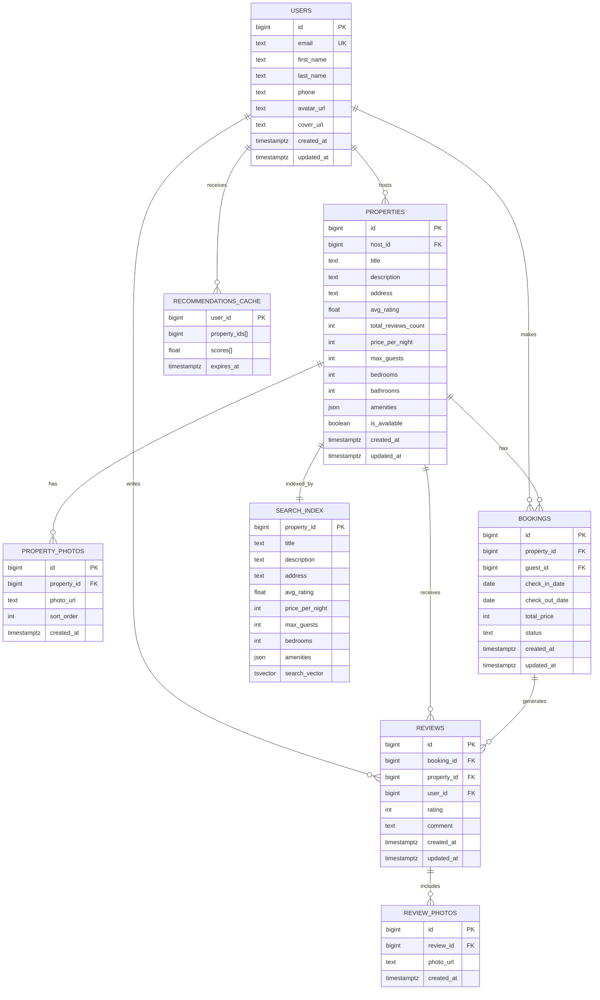

Курсовой проект по дисциплине "Проектирование высоконагруженных систем" (Highload).

---

## Содержание:
1. [Тема и целевая аудитория](#1)
2. [Расчёт нагрузки](#2)
3. [Глобальная балансировка нагрузки](#3)
4. [Локальная балансировка нагрузки](#4)

11. [Список ресурсов](#11)

---

## 1. Тема и целевая аудитория 

**Booking.com** — лидер мирового рынка онлайн-бронирования путешествий. Сервис объединяет миллионы объектов размещения (от частных апартаментов до пятизвездочных отелей) с арендаторами по всему миру.

### MVP
- Страница объявления с фотографиями и описанием.
- Система бронирования (транзакции, управление статусами).
- Статус доступности объекта в реальном времени.
- Создание и редактирование профиля пользователя.
- Создание и публикация отзывов.
- Создание и публикация объявлений.
- Просмотр отзывов и рейтингов.
- Поиск и фильтрация объектов.
- Рекомендации.

### Продуктовые метрики
- **Количество посещений в месяц:** ~560 млн пользователей [^1]
- **DAU (Daily Active Users):** ~17 млн активных пользователей [^2]
- **Объекты:** ~28 млн объявлений [^8]
- **Пользователи:** ~80 млн(на основе данных по Trip Adviser)[^5]

#### Региональное распределение:

| Регион                  | Процент |
|-------------------------|:---------:|
| CША                     | 10,13%  | 
| Великобритания          | 7,67%   |
| Германия                | 6,5%    | 
| Италия                  | 6,14%   |
| Другие                  | 63,44%  | 

---

## 2. Расчет нагрузки 

При показателях MAU ~560 млн и DAU ~17 млн, мы можем вычислить пиковую нагрузку. Данные по количеству зарегистрированных пользователей не были найедны, поэтому возьмем, как аналог, данные Tripadvisor - ~80 млн[^5]

* **Средний размер хранилища пользователя:**

| Данные           | Кол-во на одного пользователя | Размер единицы | Общий размер |
| ---------------- | ----------------------------- | -------------- | ------------ |
| Профиль          | 1                             | 410 КБ         | 410 КБ         |
| Текстовые отзывы | 4                             | 2 КБ           | 8 КБ        |
| Фото в отзывах   | 2                             | 200 КБ         | 400 КБ         |

*Профиль*: фото профиля (200 КБ), обложка профиля (200 КБ), остальная информация (имя, дата присоединения, избранное и т.п.) (10 КБ).

*Текстовые отзывы*: на данный момент на сайте опубликовано около 300 млн отзывов[^4]. Отзывы могут оставлять только зарегистрированные пользователи. Итак, в среднем 300млн / 80 млн ~ 4 отзыва на 1 пользователя.

*Фото в отзывах*(данные взяты по TripAdvisor): путешественники опубликовали более 160 млн таких фото[^6]. Итак, в среднем 160 млн / 80 млн = 2 фото на 1 пользователя.

Таким образом, данные, связанные с 1 пользователем, занимают в среднем **1 МБ** хранилища.

#### Среднее значение действий пользователя в день:

| Действие                          | Среднее количество в день на пользователя |
|-----------------------------------|-------------------------------------------|
| Поиск по параметрам               | 2                                         |
| Получение объявления              | 5                                        |
| Просмотр отзывов                  | 1,6                                         |
| Загрузка/изменение объявления     | 0.1                                       |
| Регистрация/Авторизация           | 0.31                                      |
| Бронирование                      | 0.2                                       |
| Публикация отзывов                | 0.005                                     |

*Публикация отзывов*: за 2022 год было опубликовано 30,2 млн отзывов[^7]. 30 млн / 365 дней / 17 млн ~ 0,005 отзыва в день в среднем на 1 зарегистрированного пользователя.

*Бронирование*: за 2023 год было сделано 1159 млн бронирований[^13]. 1159 млн / 365 дней / 17 млн ~ 0,2 бронирования в день на 1 пользователя

*Регситрация/Авторизация*: колличество зарегистрированных пользователей - 80 млн. 80 млн / 365 дней / 17 млн ~ 0,01 регистрация в день. Так как данных по количеству авторизаций нет, возьмем в учет то, что пользователь делает 0,2 бронирования в день. Значит в месяц получается около 6 бронирований в месяц. учитывая, что авторизация хранится в сессии, возьмем в среднем 3 авторизации в месяц. Значит, в день получается 0,3 авторизации. Общее число ~0,31 регистраций и авторизаций в день

*Загрузка/изменение объявления*: всего объявлений - 28 млн. Допустим, что каждый пользователь (арендодатель) публикует в месяц около 2 объявлений и редактирует их дважды. Тогда в день получается около 0,1 загрузок и редактирований

*Просмотр отзывов*: по данным статистики[^14] Каждый пользователь читает минимум 4 отзыва перед бронированием. Возьмем в среднем 8 отзывов на 1 бронирование. Тогда 8 отзывов х 0,2 бронирования в день = 1,6 просмотренных отзывов

*Получение объявлений*: основываясь на статистике[^3], количество страниц на 1 пользователя в день - 8 страниц. первая страница - главная, вторая - страница аккаунта пользователя, третья - страница с поиском объявлений. Тогда 5 страниц - страницы с каждым объявлением На одной странице 1 объявление. На 5 страницах - 5 объявлений.

*Поиск по параметрам*: 

### Технические метрики

* **Общий объем хранимых данных:**

| Данные       | Размер |
| ------------ | ------ |
| Бронирование      | 44 ТБ  |
| Отзывы | 74 ТБ |
| Объявления       | 147 ТБ  |
| профиль      | 160 ТБ  |

*Объявления*: для каждого объявления хранятся общие данные (название, описание, адрес, рейтинг, категории и т.п.) (~ 0,5 МБ), фотографии (около 10 штук по 200 КБ каждая). Общее число объектов[^8] - 28 млн. Тогда (512 КБ + 10 * 200 КБ) * 28 млн = 66 ТБ.

*Профили*: 1 МБ * 80 млн (зарегистрированных пользователей[^5]) = 80 ТБ.

*Отзывы*: общее число отзывов[^4] - 300 млн,  общее число фото[^5] - 160 млн. Тогда 5,12 КБ * 300млн + 200 КБ * 160 млн = 32 ТБ.

*Бронирование*: примерно 0.5 КБ на одно бронирование, количество броней за последние 5 лет в среднем 4450 млн. Тогда 4475 млн. * 0.5 КБ = 2.3 ТБ

Общий объем хранилища составляет **181 ТБ**.

#### Сетевой трафик

Для существенных типов трафика при расчёте используется коэффициент суточной неравномерности *k* = 2 для определения пиковой нагрузки.

| Тип трафика | Суточный объём (Тбайт/сут) | Средний трафик (Гбит/с) | Пиковый трафик (*k*=2) (Гбит/с) |
| :--- | :--- | :--- | :--- |
| **Поиск объектов** | 17 млн × 2 × 1 Mбайт ≈ 34,1 | (34,1 × 8 × 1000) / 86400 = 3,16 | 6,32 |
| **Просмотр карточки объекта** | 17 млн × 5 × 5,5 Mбайт ≈ 490 | (490 × 8 × 1000) / 86400 = 45,4 | 90,8 |
| **Просмотр отзывов** | 17 млн × 1,6 × 0,5 МБ ≈ 13,6 | (13,6 × 8 × 1000) / 86400 = 1,26 | 2,52 |
| **Загрузка / изменение объявления** | 17 млн × 0,1 × 2 МБ ≈ 34,1 | (34,1 × 8 × 1000) / 86400 = 3,16 | 6,32 |
| **Публикация отзывов (фото)** | 17 млн × 0,005 × 0,4 МБ ≈ 6,8 | (6,8 × 8 × 1000) / 86400 = 0,63 | 1,26 |
| **Регистрация / авторизация** | 17 млн × 0,31 × 0,05 МБ ≈ 6,8 | (0,5 × 8 × 1000) / 86400 = 0,05 | 0,1 |
| **Бронирование** | 17 млн × 0,2 × 0,05 МБ ≈ 1,7 | (1,7 × 8 × 1000) / 86400 = 0,16 | 0,32 |
| **Итого** | **~580,8** | **~53,8** | **~107,6** |

Формула: *Трафик* = [ср. кол-во действий в день на 1 польз.] × [трафик на 1 действие] / 24 / 60 / 60 × DAU.

## RPS

RPS рассчитывается по формуле: **RPS = (DAU × Действия в сутки) / 86 400**.

| Тип запроса | Общее кол-во запросов в сутки | Средний RPS | Пиковый RPS (*k*=2) |
| :--- | :--- | :--- | :--- |
| **Поиск объектов** | 17 млн × 2 = 34 млн | 394 | 788 |
| **Просмотр карточки объекта** | 17 млн × 5 = 85 млн | 984 | 1 968 |
| **Просмотр отзывов** | 17 млн × 1,6 = 27,2 млн | 315 | 630 |
| **Загрузка / изменение объявления** | 17 млн × 0,1 = 1,7 млн | 20 | 40 |
| **Публикация отзывов** | 17 млн × 0,005 = 85 тыс. | 1 | 2 |
| **Регистрация / авторизация** | 17 млн × 0,31 = 5,27 млн | 61 | 122 |
| **Бронирование** | 17 млн × 0,2 = 3,4 млн | 39 | 78 |
| **Итого** | **~156,66 млн** | **~1 814** | **~3 628** |

# 3. Глобальная балансировка нагрузки

## 3.1 Функциональное разбиение по доменам

Для оптимизации обработки разнородных запросов и независимого масштабирования сервисов используются следующие домены:

| Доменное имя | Назначение |
| --- | --- |
| **`api.booking.com`** | Основное API (поиск, бронирование, профили, отзывы) |
| **`distribution-xml.booking.com`** | API для коммерческих партнёров (Demand API) [^15][^16] |
| **`supply-xml.booking.com`** | API для поставщиков жилья (Connectivity API) [citation:7] |
| **`secure-supply-xml.booking.com`** | Защищённый API для PCI/бронирований [citation:7] |
| **`bstatic.com`** | CDN для раздачи статики (фото отелей, JS, CSS) [citation:8] |
| **`booking.com`** | Основной веб-сайт (HTML-страницы) |

## 3.2 Расположение дата-центров

Booking.com использует гибридную инфраструктуру: собственная on-premises инфраструктура в сочетании с AWS [^17][^18][^19].

| ID | Локация | Обслуживаемый регион |
| --- | --- | --- |
| **DC-EU1, DC-EU2** | Амстердам / Франкфурт (Нидерланды / Германия) | Европа, Африка |
| **DC-US1, DC-US2** | Северная Вирджиния / Орегон (США) | Северная и Южная Америка |
| **DC-AP1** | Сингапур | Азия, Океания |

**Обоснование выбора:**

* **Амстердам:** штаб-квартира Booking.com, крупнейшая точка обмена трафиком в Европе. Обслуживает **~71,7%** трафика из Европы [^17].
* **Северная Вирджиния:** оптимальная точка входа в Северную Америку (**~13,5%** трафика).
* **Сингапур:** ключевой узел в Азиатско-Тихоокеанском регионе (**~11,5%** трафика + быстрорастущий рынок).

**Дополнительно:** Booking.com использует **Amazon CloudFront** для CDN-раздачи контента по всему миру [citation:2][citation:5][citation:8].

## 3.3 Распределение запросов по ДЦ

Нагрузка распределяется пропорционально активной аудитории регионов, исходя из рассчитанного пикового RPS **~3 628** (п. 2.2) и данных о региональном распределении трафика[^19].

| Регион (ДЦ) | Процент трафика | Пиковый RPS | Обоснование |
| --- | --- | --- | --- |
| **Европа (DC-EU1, EU2)** | **71,7%** | **~2 600** | Крупнейший регион: Германия, Италия, Нидерланды, Дания, Грузия, Швейцария, Кипр, Норвегия |
| **Америка (DC-US1, US2)** | **13,5%** | **~490** | США (13,49% трафика) |
| **Азия и другие (DC-AP1)** | **14,8%** | **~538** | Марокко (Африка) + другие регионы (Азия, Океания) |
| **Итого** | **100%** | **~3 628** | |

**Детализация по Европе (71,7% трафика):[^19]**

| Страна | % от общего трафика | Пиковый RPS |
|--------|---------------------|-------------|
| Германия | 19,04% | ~690 |
| Италия | 16,99% | ~616 |
| Нидерланды | 9,69% | ~352 |
| Дания | 6,43% | ~233 |
| Грузия | 5,94% | ~216 |
| Швейцария | 5,50% | ~200 |
| Кипр | 4,82% | ~175 |
| Норвегия | 3,26% | ~118 |

## 3.4 Схема балансировки

Booking.com использует двухуровневую схему балансировки на основе **ECMP (Equal-Cost Multi-Path routing)**, **Anycast** и **HAProxy**[^17] .

### Уровень 1: Anycast + ECMP на уровне L3 (коммутаторы)

Трафик от пользователя попадает на **fabric switches** — коммутаторы ядра сети. С помощью Anycast пользователь направляется в ближайший ДЦ[^17]. Fabric switch на основе хэша потока (5-tuple: src IP, src port, dst IP, dst port) выбирает один из 5 равнозначных путей к **top-of-rack (ToR) коммутаторам** .

### Уровень 2: HAProxy на уровне L7

ToR коммутатор на основе хэша направляет трафик к одному из **HAProxy-балансировщиков** (актив-актив конфигурация)[^17]. HAProxy обеспечивает:
- Termination SSL
- Маршрутизацию к микросервисам
- Инъекцию/модификацию заголовков
- Health checks бэкендов

### Управление: Balancer API

Booking.com разработал собственную систему **Balancer** — Load Balancer as a Service (LBaaS) с единым API для управления всей инфраструктурой балансировки[^17]. Balancer API хранит конфигурацию в БД (объекты: load balancers, virtual servers, pools, servers) и автоматизирует provisioning[^17].

### Особенности архитектуры Booking.com[^17]

- **Актив-актив** конфигурация (нет простаивающих резервных устройств) 
- Горизонтальное масштабирование: **сотни HAProxy** вместо двух гигантских F5 
- **Сотни гигабит трафика** и **миллиарды запросов в день** 
- Интеграция с **Graphite** (метрики) и **Elasticsearch** (логи) 

## 3.5 Механизмы регулировки трафика

1. **Weighted Round-Robin:** использование весовых коэффициентов для управления долями входящего трафика между ДЦ в одном регионе .
2. **Active Health Checks:** HAProxy постоянно мониторит состояние бэкендов. При деградации сервиса — автоматическое исключение из пула .
3. **Anycast Healthchecker:** мониторинг состояния ДЦ. При падении ДЦ BGP-маршруты автоматически переключаются на ближайший работающий ДЦ .
4. **Smart Routing:** защита от сценариев отказа на всех уровнях сети (коммутаторы, балансировщики, серверы приложений) .
5. **Оркестрация через Balancer API:** автоматическое provisioning серверов, настройка HAProxy, управление пулами .

# 4. Локальная балансировка нагрузки

## 4.1 Схема балансировки

Внутри дата-центра реализована двухуровневая схема балансировки, основанная на архитектуре, описанной Booking.com на HAProxy Conf 2019 [^17].

**L4-балансировщик:**

| Параметр | Описание |
| --- | --- |
| **Реализация** | LVS (Linux Virtual Server) / ECMP на коммутаторах |
| **Режим работы** | Virtual Server via Direct Routing. Входящий трафик распределяется между узлами L7, а исходящий трафик идёт напрямую к клиенту, что минимизирует нагрузку на балансировщик [^17]. |
| **Резервирование** | Схема N × 2. Keepalived обеспечивает автоматическое переключение Virtual IP на резервный узел при отказе основного. |

Booking.com изначально использовал пару Linux-серверов с IPVS и Keepalived для L4-балансировки, но затем перешёл на ECMP (Equal-Cost Multi-Path routing) на уровне коммутаторов fabric layer [^17]. ECMP позволяет балансировать трафик на линейной скорости, так как не требует таблицы сессий — хэш потока вычисляется для каждого пакета [^17].

**L7-балансировщик:**

| Параметр | Описание |
| --- | --- |
| **Реализация** | Кластер серверов HAProxy |
| **Функции** | SSL Termination, распределение запросов по микросервисам, маршрутизация на основе URL, health checks  |
| **Оптимизация** | Session tickets для ускорения повторных TLS-соединений |
| **Резервирование** | Схема N + 1 |

Booking.com перешёл с F5 BIG-IP на HAProxy, поскольку F5 были физическими серверами, не поддающимися автоматизации конфигурации, и требовали ручного обновления [^20]. Новая архитектура позволила масштабироваться горизонтально — от пары балансировщиков до сотен, обрабатывающих миллиарды запросов в день[^20].

## 4.2 Расчёт количества балансировщиков

Расчёт выполнен для наиболее загруженного дата-центра (DC-EU1 — Европа) в «худшем» случае:

* **Пиковый трафик:** 107,6 Гбит/с (из п. 2.2 — Сетевой трафик, итого пиковый)
* **Пиковая нагрузка:** 3 628 RPS (из п. 2.2 — RPS, итого пиковый)

### 1. Расчёт узлов L4

Целевая конфигурация — серверы с сетевыми интерфейсами 25GbE (для Европы с трафиком 107,6 Гбит/с достаточно 25GbE, так как 100GbE избыточен). Ограничитель — пропускная способность канала.

**Расчёт активных узлов:**

107,6 Гбит/с ÷ 25 Гбит/с = 4,3 → 5 серверов

С учётом резервирования (N × 2): на каждую активную ноду нужен резерв.

**Итого:** 10 серверов.

### 2. Расчёт узлов L7

Конфигурация узлов: 8 CPU, NIC 25GbE. Учитываются два ограничителя: пропускная способность и SSL Termination.

**По пропускной способности:**

107,6 Гбит/с ÷ 25 Гбит/с = 4,3 → 5 серверов

**По SSL Termination:**

Интенсивность новых TLS-соединений принята равной общему RPS (так как каждый запрос может требовать нового TLS-рукопожатия или возобновления сессии):

3 628 RPS = 3 628 CPS (connections per second)

При производительности одного сервера 6 676 CPS (на базе 8 CPU cores, аналогично эталонному серверу из источника):

3 628 CPS ÷ 6 676 CPS ≈ 0,54 → 1 сервер

Так как расчёт по SSL даёт 1 сервер, а по пропускной способности — 5 серверов, выбираем «худший» случай — **5 серверов**.

С учётом резервирования (N + 1): 5 + 1 = 6 серверов.

**Итого:** 6 серверов.

### 3. Альтернативный расчёт для других ДЦ

| ДЦ | Пиковый трафик, Гбит/с | Пиковый RPS | L4 (25GbE) | L7 (по трафику) | L7 (по SSL) | L7 итого (N+1) |
| --- | --- | --- | --- | --- | --- | --- |
| **DC-EU1, EU2** (Европа) | 107,6 | 3 628 | 10 | 5 | 1 | 6 |
| **DC-US1, US2** (Америка) | ~25 (13,5% от 107,6) | ~490 | 4 | 1 | 1 | 2 |
| **DC-AP1** (Азия и др.) | ~27,5 (14,8% от 107,6) | ~538 | 4 | 1 | 1 | 2 |

## 4.3 Итоговая конфигурация оборудования

### Для Европы (DC-EU1, DC-EU2) — наиболее загруженный регион

| Уровень | Количество | Конфигурация узла | Тип резервирования |
| --- | --- | --- | --- |
| **L4** | 10 | CPU 4 Cores, NIC 25GbE | N × 2 |
| **L7** | 6 | CPU 8 Cores, NIC 25GbE | N + 1 |

### Для Америки (DC-US1, DC-US2)

| Уровень | Количество | Конфигурация узла | Тип резервирования |
| --- | --- | --- | --- |
| **L4** | 4 | CPU 4 Cores, NIC 25GbE | N × 2 |
| **L7** | 2 | CPU 8 Cores, NIC 25GbE | N + 1 |

### Для Азии (DC-AP1)

| Уровень | Количество | Конфигурация узла | Тип резервирования |
| --- | --- | --- | --- |
| **L4** | 4 | CPU 4 Cores, NIC 25GbE | N × 2 |
| **L7** | 2 | CPU 8 Cores, NIC 25GbE | N + 1 |

### Общая потребность по всем ДЦ

| Уровень | Всего серверов | Конфигурация узла |
| --- | --- | --- |
| **L4** | 10 (EU) + 4 (US) + 4 (AP) = **18** | CPU 4 Cores, NIC 25GbE |
| **L7** | 6 (EU) + 2 (US) + 2 (AP) = **10** | CPU 8 Cores, NIC 25GbE |
| **Итого** | **28** | |

## 4.4 Обоснование выбора NIC 25GbE

Для Booking.com с пиковым трафиком **107,6 Гбит/с** использование 100GbE NIC является избыточным, так как:
- 100GbE требует более дорогого сетевого оборудования (коммутаторы, трансиверы)
- 25GbE обеспечивает достаточную пропускную способность с запасом (5 узлов × 25 Гбит/с = 125 Гбит/с > 107,6 Гбит/с)
- 25GbE — стандарт де-факто для высоконагруженных систем среднего размера

При росте трафика в будущем возможно поэтапное обновление до 100GbE.

---

# 5. Логическая схема БД

## 5.1 Схема БД

```mermaid
erDiagram
    USERS {
        bigint id PK
        text email UK
        text first_name
        text last_name
        text phone
        text avatar_url
        text cover_url
        timestamptz created_at
        timestamptz updated_at
    }

    PROPERTIES {
        bigint id PK
        bigint host_id FK
        text title
        text description
        text address
        float rating
        int price_per_night
        int max_guests
        int bedrooms
        int bathrooms
        json amenities
        boolean is_available
        timestamptz created_at
        timestamptz updated_at
    }

    PROPERTY_PHOTOS {
        bigint id PK
        bigint property_id FK
        text photo_url
        int sort_order
        timestamptz created_at
    }

    BOOKINGS {
        bigint id PK
        bigint property_id FK
        bigint guest_id FK
        date check_in_date
        date check_out_date
        int total_price
        text status
        timestamptz created_at
        timestamptz updated_at
    }

    REVIEWS {
        bigint id PK
        bigint booking_id FK
        bigint property_id FK
        bigint user_id FK
        int rating
        text comment
        timestamptz created_at
        timestamptz updated_at
    }

    REVIEW_PHOTOS {
        bigint id PK
        bigint review_id FK
        text photo_url
        timestamptz created_at
    }

    SEARCH_QUERIES {
        uuid id PK
        text query
        text filters
        bigint user_id FK
        timestamptz created_at
    }

    RECOMMENDATIONS {
        bigint id PK
        bigint user_id FK
        bigint property_id FK
        float score
        timestamptz created_at
    }

    USERS ||--o{ PROPERTIES : hosts
    USERS ||--o{ BOOKINGS : makes
    USERS ||--o{ REVIEWS : writes
    USERS ||--o{ SEARCH_QUERIES : performs
    USERS ||--o{ RECOMMENDATIONS : receives

    PROPERTIES ||--o{ PROPERTY_PHOTOS : has
    PROPERTIES ||--o{ BOOKINGS : has
    PROPERTIES ||--o{ REVIEWS : receives

    BOOKINGS ||--o{ REVIEWS : generates

    REVIEWS ||--o{ REVIEW_PHOTOS : includes
```

## 5.2 Таблица с описанием таблиц

| Таблица | Описание | Размер строки | Количество строк | Размер таблицы | Нагрузка на запись (QPS, пик) | Нагрузка на чтение (QPS, пик) |
| :--- | :--- | :--- | :--- | :--- | :--- | :--- |
| **`users`** | Профили пользователей (гости + хосты) | id(8) + email(50) + first_name(30) + last_name(30) + phone(15) + avatar_url(100) + cover_url(100) + created_at(8) + updated_at(8) ≈ 349 Б | 80 млн | ~28 ГБ | 61 | 1 814 |
| **`properties`** | Объявления (отели, апартаменты) | id(8) + host_id(8) + title(100) + description(500) + address(200) + rating(4) + price_per_night(4) + max_guests(2) + bedrooms(2) + bathrooms(2) + amenities(500) + is_available(1) + created_at(8) + updated_at(8) ≈ 1,35 КБ | 28 млн | ~38 ГБ | 20 | 1 968 |
| **`property_photos`** | Фотографии объявлений | id(8) + property_id(8) + photo_url(200) + sort_order(2) + created_at(8) ≈ 226 Б | 280 млн | ~63 ГБ | 20 | 1 968 |
| **`bookings`** | Бронирования | id(8) + property_id(8) + guest_id(8) + check_in_date(4) + check_out_date(4) + total_price(4) + status(20) + created_at(8) + updated_at(8) ≈ 72 Б | 1,16 млрд (за 5 лет) | ~83 ГБ | 39 | 78 |
| **`reviews`** | Отзывы пользователей | id(8) + booking_id(8) + property_id(8) + user_id(8) + rating(2) + comment(2000) + created_at(8) + updated_at(8) ≈ 2,05 КБ | 300 млн | ~615 ГБ | 1 | 630 |
| **`review_photos`** | Фотографии в отзывах | id(8) + review_id(8) + photo_url(200) + created_at(8) ≈ 224 Б | 160 млн | ~36 ГБ | 1 | 630 |
| **`search_queries`** | История поисков | id(16) + query(100) + filters(500) + user_id(8) + created_at(8) ≈ 632 Б | 34 млн/сут | ~21 ГБ/сут | 788 | 394 |
| **`recommendations`** | Рекомендации (кэш) | id(8) + user_id(8) + property_id(8) + score(4) + created_at(8) ≈ 36 Б | 1,6 млрд/сут | ~58 ГБ/сут | 1 814 | 1 814 |

## 5.3 Требования к консистентности

| Таблица | Требование | Обоснование |
| :--- | :--- | :--- |
| **`users`** | Strong Consistency | Данные профиля должны быть актуальны при каждой авторизации |
| **`properties`** | Strong Consistency | Статус доступности и цены должны быть точными для бронирования |
| **`property_photos`** | Eventual Consistency | Небольшая задержка при загрузке фото допустима |
| **`bookings`** | Strong Consistency | Транзакции с деньгами требуют строгой консистентности (ACID) |
| **`reviews`** | Strong Consistency | Отзывы должны быть видны сразу после публикации |
| **`review_photos`** | Eventual Consistency | Аналогично property_photos |
| **`search_queries`** | Eventual Consistency | Аналитика, допустима задержка |
| **`recommendations`** | Eventual Consistency | Кэш рекомендаций можно обновлять асинхронно |

# 6. Физическая схема БД

## Денормализация

1. Для оптимизации загрузки главной страницы (списка популярных объявлений) в таблицу `properties` добавлено поле `avg_rating` — средний рейтинг, который обновляется асинхронно при добавлении новых отзывов. Это позволяет отображать рейтинг без JOIN с `reviews`.
2. В `properties` хранится `total_reviews_count` для быстрого отображения количества отзывов без агрегации по `reviews`.
3. Для ускорения поиска добавлена таблица `search_index` — денормализованное представление объявлений с ключевыми полями для фильтрации.
4. Фотографии вынесены из таблиц в объектное хранилище (S3); в PostgreSQL остаются `photo_url`.

## 6.1 Выбор СУБД

| Таблица / Хранилище | СУБД / хранилище | Обоснование |
| :--- | :--- | :--- |
| `users`, `properties`, `property_photos`, `bookings`, `reviews`, `review_photos` | **PostgreSQL** | ACID-транзакции (бронирования, платежи), строгая консистентность, сложные JOIN-запросы |
| `search_index` | **Elasticsearch** | Полнотекстовый поиск, геопоиск, фильтрация по множеству полей, высокая производительность чтения |
| `recommendations_cache` | **Redis** | Низкая задержка, частые чтения, TTL для кэша рекомендаций |
| Фотографии (файлы) | **S3-совместимое хранилище** | Хранение больших бинарных данных, CDN-раздача, георепликация |

**Итого:**

- **PostgreSQL:** `users`, `properties`, `property_photos`, `bookings`, `reviews`, `review_photos`
- **Elasticsearch:** `search_index`
- **Redis:** `recommendations_cache`, кэш сессий, кэш популярных объявлений
- **S3:** объекты по ключу из `photo_url`

## 6.2 Индексы

| Таблица | Поле | Тип индекса | Обоснование |
| :--- | :--- | :--- | :--- |
| `users` | `id` | B-Tree | Поиск профиля по ID |
| `users` | `email` | Hash | Поиск при авторизации |
| `users` | `phone` | Hash | Поиск при авторизации |
| `properties` | `id` | B-Tree | Доступ к карточке объявления |
| `properties` | `host_id` | B-Tree | Поиск всех объявлений хоста |
| `properties` | `(price_per_night, avg_rating)` | Composite B-Tree | Сортировка и фильтрация при поиске |
| `properties` | `is_available` | B-Tree | Фильтрация только доступных объявлений |
| `property_photos` | `(property_id, sort_order)` | Composite B-Tree | Получение всех фото объявления в правильном порядке |
| `bookings` | `guest_id` | B-Tree | История бронирований пользователя |
| `bookings` | `property_id` | B-Tree | Поиск броней для календаря доступности |
| `bookings` | `(guest_id, status)` | Composite B-Tree | Фильтрация активных/завершённых броней |
| `reviews` | `property_id` | B-Tree | Получение всех отзывов об объявлении |
| `reviews` | `user_id` | B-Tree | Все отзывы, написанные пользователем |
| `reviews` | `(property_id, rating)` | Composite B-Tree | Сортировка отзывов по рейтингу |
| `search_index` | `search_vector` | GIN (PostgreSQL) / Inverted Index (Elasticsearch) | Полнотекстовый поиск по заголовку, описанию, адресу |
| `search_index` | `(price_per_night, avg_rating, bedrooms)` | Composite B-Tree | Фильтрация и сортировка результатов поиска |
| `recommendations_cache` | `user_id` | Redis Key | Быстрое получение персонализированных рекомендаций |

## 6.3 Шардирование и резервирование СУБД

**Шардирование**

| Таблица | СУБД | Ключ шардирования | Обоснование |
| :--- | :--- | :--- | :--- |
| `users` | PostgreSQL | `id` | Равномерное распределение нагрузки |
| `properties` | PostgreSQL | `id` | Равномерное распределение объявлений |
| `property_photos` | PostgreSQL | `property_id` | Все фото одного объявления на одном узле |
| `bookings` | PostgreSQL | `guest_id` | Все бронирования одного гостя на одном узле |
| `reviews` | PostgreSQL | `property_id` | Все отзывы об одном объекте на одном узле |
| `review_photos` | PostgreSQL | `review_id` | Все фото одного отзыва на одном узле |
| `search_index` | Elasticsearch | `property_id` (routing) | Документ одного объявления на одном шарде |
| `recommendations_cache` | Redis | `user_id` | Кэш одного пользователя на одном узле кластера |

**Резервирование**

| СУБД | Схема | Обоснование |
| :--- | :--- | :--- |
| PostgreSQL | Master–Replica (1 мастер, 2 реплики). Запись на мастер, чтение с реплик. Автоматический failover через Patroni | Исключение единой точки отказа, распределение нагрузки чтения (1 814–1 968 RPS) |
| Elasticsearch | Каждый шард имеет 1 реплику (Replication Factor = 2). Master-узел выбирается автоматически | Отказоустойчивость поиска, сохранение данных при падении узла |
| Redis | Redis Cluster (мастер + реплика на каждый слот). Автоматический failover | Отказоустойчивость кэша рекомендаций |
| S3 | Георепликация между регионами (EU, US, AP) | Защита от отказа целого дата-центра, быстрая CDN-раздача фото |

## 6.4 Клиентские библиотеки и интеграции

| СУБД | Примеры для Go | Примеры для Python |
| :--- | :--- | :--- |
| PostgreSQL | `pgx`, `jackc/pgx` | `psycopg2`, `asyncpg`, `SQLAlchemy` |
| Elasticsearch | `elastic/go-elasticsearch` | `elasticsearch-py`, `elasticsearch-dsl` |
| Redis | `go-redis/redis` | `redis-py`, `aredis` |
| S3 | `minio-go`, `aws-sdk-go` | `boto3`, `minio-py` |

## 6.5 Балансировка запросов и мультиплексирование подключений

| СУБД | Механизм | Как работает |
| :--- | :--- | :--- |
| PostgreSQL | PgBouncer (пул соединений) | PgBouncer поддерживает пул постоянных соединений к PostgreSQL, объединяя множество коротких подключений в ограниченное число долгоживущих сессий. Это снижает накладные расходы на создание новых соединений (пик ~3 628 RPS) |
| Elasticsearch | Встроенный HTTP-балансировщик + клиентское кеширование | Клиент получает список узлов и распределяет запросы round-robin. Запросы к поиску кешируются на уровне приложения |
| Redis | Smart Client (go-redis) | Клиент сам вычисляет, какой узел кластера отвечает за ключ (CRC16 хэш слота), и обращается к нему напрямую |
| S3 | CDN + GeoDNS | Медиафайлы раздаются через CDN (CloudFront) — edge-серверы ближе к пользователю. При отказе региона GeoDNS перенаправляет на работающий S3-бакет |

## 6.6 Схема резервного копирования

| Хранилище | Что бэкапим | Как бэкапим | Зачем |
| :--- | :--- | :--- | :--- |
| PostgreSQL | `users`, `properties`, `property_photos`, `bookings`, `reviews`, `review_photos` | Ежедневный полный бэкап + непрерывная архивация WAL (pg_basebackup + WAL-G) | Можно восстановить на любой момент времени (до секунды). Критично для бронирований и платежей |
| Elasticsearch | `search_index` | Ежедневные снапшоты (Elasticsearch Snapshot API) + инкрементальные бэкапы изменений | Восстановление поискового индекса при коррупции данных |
| Redis | `recommendations_cache`, сессии | AOF (каждую секунду) + RDB (раз в час) | Минимум потерь (до 1 секунды), легкое восстановление кэша |
| S3 | Фото объявлений, фото отзывов, аватары | Георепликация между регионами (EU → US → AP) | Сами файлы не бэкапятся отдельно — устойчивость за счёт копирования в другие регионы. При падении региона — автоматическое переключение |

## 6.7 Сводная таблица требований к БД

| Хранилище | Таблицы / данные | RPS чтения (пик) | RPS записи (пик) | Объём данных | Ключевое требование |
| :--- | :--- | :--- | :--- | :--- | :--- |
| PostgreSQL | `users` | 1 814 | 61 | ~28 ГБ | Strong Consistency |
| PostgreSQL | `properties` | 1 968 | 20 | ~38 ГБ | Strong Consistency |
| PostgreSQL | `property_photos` | 1 968 | 20 | ~63 ГБ | Strong Consistency |
| PostgreSQL | `bookings` | 78 | 39 | ~83 ГБ | Strong Consistency (ACID) |
| PostgreSQL | `reviews` | 630 | 1 | ~615 ГБ | Strong Consistency |
| PostgreSQL | `review_photos` | 630 | 1 | ~36 ГБ | Strong Consistency |
| Elasticsearch | `search_index` | 788 | 788 | ~21 ГБ/сут | Eventual Consistency |
| Redis | `recommendations_cache` | 1 814 | 1 814 | ~58 ГБ/сут | Eventual Consistency |
| S3 | Фото (все) | ~90 Гбит/с (исходящий трафик) | ~6 Гбит/с (входящий) | ~147 ТБ (всего) | Eventual Consistency |

## 11. Список ресурсов 

[^1]: [Официальный отчет Booking Holdings](https://electroiq.com/stats/booking-com-statistics/)
[^2]: [Статистика трафика SimilarWeb](https://hypestat.com/info/booking.com) [2]
[^3]: [Бизнес-аналитика BusinessOfApps](https://www.similarweb.com/ru/website/booking.com/#traffic) [3]
[^4]: [Количество отзывов на booking](https://www.booking.com) [4]
[^5]: [Количество зарегистрированных пользователей на TripAdvisor](https://ru.wikipedia.org/wiki/Tripadvisor) [5]
[^6]: [Количество фото на отзывах](https://review42.com/resources/tripadvisor-statistics/) [6]
[^7]: [Статистика отзывов по TripAdvisor](https://passport-photo.online/blog/tripadvisor-statistics/)) [7]
[^8]: [Количество объявлений](https://www.dreambigtravelfarblog.com/blog/booking-com-statistics) [8]
[^9]: [Количество броней за 2023 год](https://topic.ru/statistics/travel/key-data/kolichestvo-bronirovaniy-cherez-booking-com-po-segmentam/) [9]
[^10]: [Распределение населения по миру](https://luminocity3d.org/WorldPopDen/#7/42.981/11.964)) [10]
[^11]: [Распределение Ixps](https://www.datacentermap.com/ixp/) [11]
[^12]: [Кабельное](https://www.submarinecablemap.com/) [12]
[^13]: [Количество бронирований за год](https://topic.ru/statistics/travel/key-data/kolichestvo-bronirovaniy-cherez-booking-com-po-segmentam/) [13]
[^14]: [Статистика просмотра отзывов](https://inclient.ru/stats-reviews/)
[^15]:
[^16]: 
[^17]: 
[^18]: 
[^19]: 
[^20]: 
